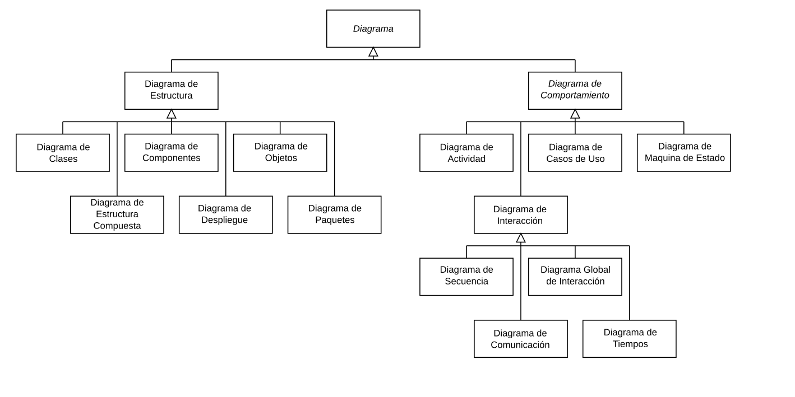
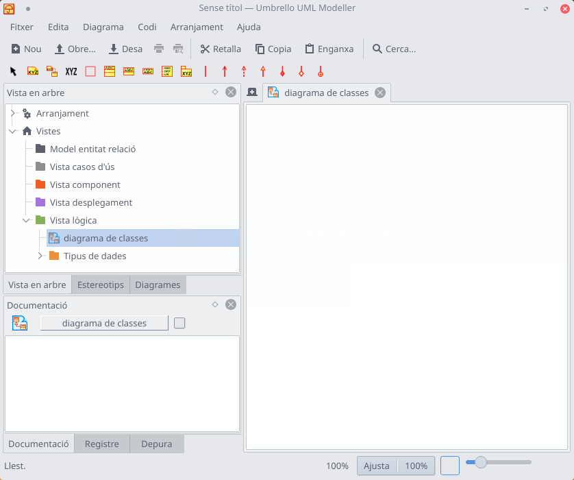
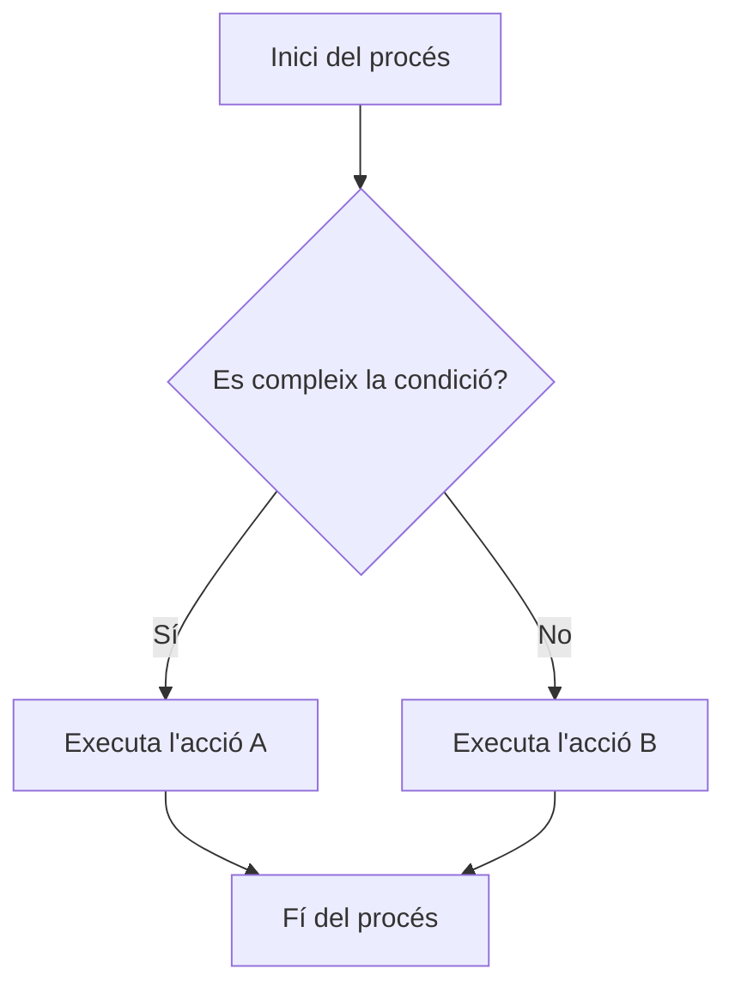
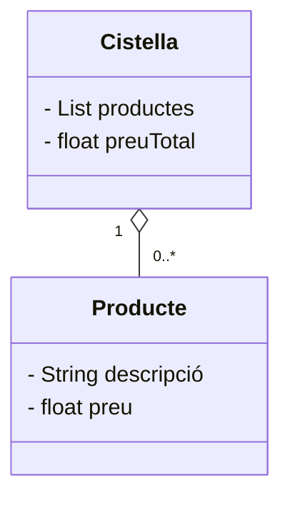
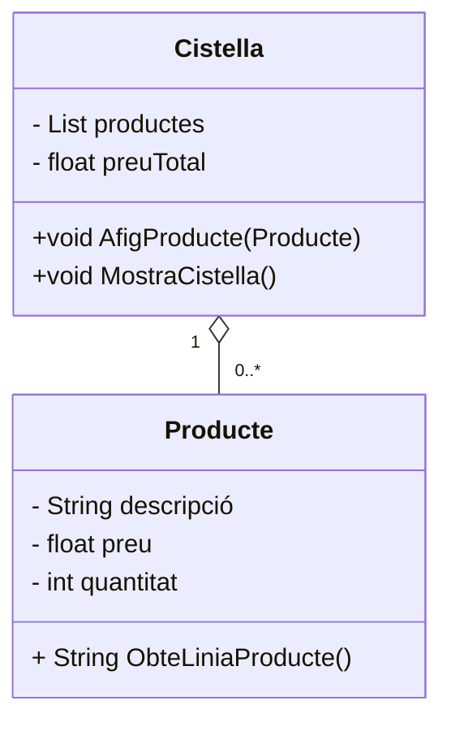
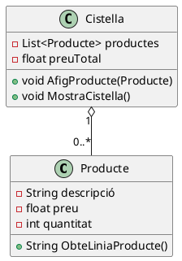
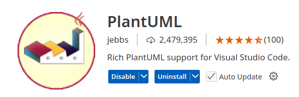
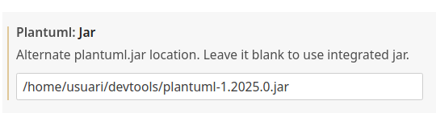
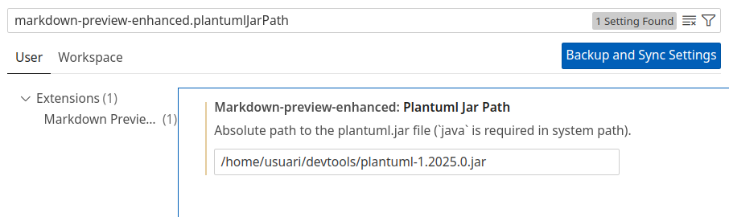

# Introducció

UML (Llenguatge Unificat de Modelat) és un llenguatge universal (conjunt d'eines, majoritàriament gràfiques i no lligat a cap llenguatge de programació concret) que ens ajuda en el disseny de sistemes que plasmen idees d'una forma convencional i fàcil d'entendre per comunicar a altres persones.

La versió actual del llenguatge és la 2.5.1, publicada la seua última revisió en desembre de 2017 ([https://www.omg.org/spec/UML](https://www.omg.org/spec/UML)). Recentment, l'ús de llenguatges per a la generació dinàmica de diagrames com *Mermaid* i *PlantUML* també ha guanyat popularitat, donant flexibilitat i integració amb altres eines de documentació.

Com vam veure a les primeres unitats, un dels principals problemes a l'hora d'abordar el desenvolupament de programari és captar amb precisió allò que desitja l'usuari. Per tal d'abordar aquest problema, i d'aportar un flux de treball coherent a l'hora de desenvolupar els sistemes, apareixen diferents metodologies de desenvolupament: Cascada, Espiral, amb Prototipat, metodologies àgils, etc. En aquestes metodologies, establíem diverses fases que abordaven la conceptualització del sistema (fase d'anàlisi), el seu disseny, la implementació i les proves i manteniment.

El llenguatge **UML** no és una metodologia en sí, sinó un **conjunt d'eines de suport per a aquestes fases de desenvolupament**. En particular, eines com *Umbrello UML* i *Mermaid* poden complementar-se per generar diagrames àgils i adaptats als requeriments.

Durant el que queda de curs, veurem UML com a suport per al desenvolupament de programari basant-nos en aquests models àgils, que van incorporant poc a poc noves funcionalitats.

# Organització d'UML

UML es compon de diferents diagrames per tal de presentar diferents perspectives d'un sistema (models).

UML 2.5 estableix dos tipus de diagrames principals: *diagrames estructurals* i *diagrames de comportament*. Jeràrquicament, podriem representar tots aquests diagrames de la següent forma (font: Wikipedia):



Veiem una descripció breu d'aquests diagrames:

* ***Diagrames Estructurals***: Representen l'**estructura estàtica** dels objectes en un sistema. Distingim els següents diagrames:

    * **Diagrama de classes**: Es tracta del tipus de diagrama més utilitzat, i mostra les clases d'un sistema, junt amb els seus atributs i operacions, així com les relacions entre les diferents classes.
    * **Diagrama d'objectes o d'instància**: Semblants als diagrames de classes, però fent ús d'exemples concrets del món real. La seua utilitat és saber com es vorà un sistema en un moment donat.
    * **Diagrama de paquets**: Mostra les dependències entre els diferents paquets (*packages*) del nostre sistema.
    * **Diagrama de components**: Mostra la relació estructural dels diferents components d'un sistema de programari. S'utilitza principalment quan treballem amb sistemes complexos, formats per diferents subsistemes que es comuniquen entre sí mitjançant APIs. Un exemple podria ser una aplicació client-servidor, on tindriem el component client i el component servidor.
    * **Diagrama de desplegament**: Mostra el maquinari i programari en sistemes que requereixen de diversos equips, amb diferents configuracions.
    * **Diagrama de perfils**: Permeten extendre l'UML per tal d'adaptar-se a una plataforma concreta de programació (ja que no tots els llenguatges orientats a objectes són exactament iguals). Així, tindrem diagrames de perfils per a Java, C#, etc.
    * **Diagrama d'estructura composta**: Mostren l'estructura interna d'una classe. És semblant al diagrama de classes, però permet entrar més en detall en l'estructura interna d'alguns components.

* ***Diagrames de comportament***: Mostren el comportament dinàmic dels objectes en el sistema:

    * **Diagrama de casos d'ús**: Es tracta d'un dels diagrames més coneguts d'UML, i ofereixen una visió general dels actors (ja siguen usuaris o altres sistemes) involucrats en el sistema, i mostren les funcions que necessiten realitzar aquests en el sistema en desenvolupament i com interactúen entre ells. És un diagrama de gran utilitat quan comencem a desenvolupar un sistema, ja que ens permet identificar fàcilment els actors i els principals processos del sistema.
    * **Diagrama d'activitats**: Mostren gràficament els fluxos de treball, tant a nivell empressarial com operatiu de qualsevol dels components del sistema.
    * **Diagrama de màquina d'estats**: Descriuen el comportament dels diferents objectes del sistema, en funció del seu estat.
    * **Diagrames d'interacció**:  Es tracta d'un subconjunt de diagrames de comportament que comprén:
        * *Diagrames de seqüència*: Mostren com interactúen entre ells els diferents objectes del sistema en un escenari en particular. 
        * *Diagrama de comunicació (anteriorment anomenat diagrama de col·laboració*): Semblant als diagrames de seqüència, però centrant-se en els misstges que es passen els diferents objectes.
        * *Diagrama de temps*: Representen el comportament dels objectes en un marc de temps donat. 
        * *Diagrama global d'interaccions*: Molt semblants als diagrames d'activitat, però mostrant una seqüència de diagrames d'interacció. Podem dir que es tracta d'una col·lecció de diagrames d'interacció i l'ordre en què aquestes ocorren.

Conéixer tots aquests diagrames i saber desenvolupar-los és feina dels enginyers de programari. Al nostre cas, anem a familiaritzar-nos amb els principals diagrames, per tal de poder entendre'ls i implementar-los, així com realitzar modificacions per tal d'ampliar la funcionalitat d'un sistema. Conéixer-los ens servirà també per aprofundir en el nostre coneixement sobre la programació orientada a objecte i l'organització del programari.


# Eines CASE i de documentació: Umbrello UML, Mermaid i PlantUML

Les eines **CASE** (*Computer-Aided Software Engineering* o *Enginyeria del programari assistida per ordinador*) son un conjunt d'eines informàtiques que ajuden en les diferents fases del cicle de vida del programari, incloent:

1. **Disseny**: Creació de diagrames UML, estructures de dades, o models d'arquitectura.
2. **Documentació**: Generació automàtica de documentació a partir dels models creats.
3. **Codificació**: Generació de codi base a partir dels models o diagrames (per exemple, generar esquelets de classes).
4. **Proves**: Suport en la generació de casos de prova i l'automatització del procés de proves.
5. **Manteniment**: Permet actualitzar diagrames i models a mesura que el sistema evoluciona.

Algunes de les eines CASE que podem trobar, i les principals característiques són:

* **Dia**: Senzill, simple i versàtil. Permet la generació de codi (Java, Python, C/C++) a partir dels diagrames de classes. No suporta UML2. Multiplataforma. Programari lliure.
* **Argo UML**: Permet la generació de codi Java a partir dels diagrames de classes. No suporta UML2. Multiplataforma. Té un gran inconvenient: no té l’opció de desfer (undo).
* **Microsoft Visio**: Permet fer varis tipus de diagrames UML.
* **Visual Paradigm**: Molt complet i intuïtiu. S’integra amb Eclipse i Netbeans, però les característiques avançades com la generació de codi i l’enginyeria inversa (crear el diagrama a partir del codi) necessiten una llicència de pagament.
* **Papyrus**: Complement d’Eclipse, gratuït però molt complex.
* **Object Aid**: Plugin d’Eclipse. Genera diagrames de classe per mitjà d’enginyeria inversa i, amb la versió de pagament, també diagrames de seqüència.
* **EasyUML**: Plugin de NetBeans. Només permet la creació de diagrames de classe.

Una altra eina, que és la que utilitzarem és ***Umbrello UML Modeller***, disponible directament des dels repositoris d'Ubuntu, i que forma part del conjunt d'eines de KDE. 

## Umbrello UML

*Umbrello UML Modeller* és una eina CASE que ens ajuda a generar diagrames UML i estructurar el nostre programari. És lliure i de codi obert, disponible per a diverses plataformes. Aquesta eina permet:

- Crear diagrames de casos d'ús i classes, entre d'altres.
- Generar codi base a partir dels diagrames creats.
- Documentar sistemes de forma visual.

Podeu instal·lar-lo en Ubuntu amb:

```
sudo apt install umbrello
```

O descarregar-lo des de la seua pàgina oficial: [https://umbrello.kde.org/](https://umbrello.kde.org/).


Com comenta a la web, *Umbrello UML Modeller* és una eina de programari lliure per a la realització de diagrames UML, que permet crear diagrames de programari i altres sistemes per tal de dissenyar la documentació i l'estructura de les nostres aplicacions.

Una vegada instal·lat, quan obrim *Umbrello UML Modeller* trobarem una interfície semblant a la següent:



Com podem veure, a la part de l'esquerra se'ns mostren diferents carpetes per a les diferents *vistes* de la nostra aplicació. Cada *vista* contindrà un o diversos tipus de diagrames. Els diagrames que utilitzarem en aquesta unitat serà el diagrama de casos d'ús (*Vista casos d'ús*), i els diagrames de classes (*Vista lògica*).

Es tracta d'una aplicació bastant senzilla, que ens permet anar creant els diagrames incorporant els diferents elements i establint les relacions entre ells. A més, també ens permetrà generar el codi de base per a les nostres aplicacions.

Podeu consultar tota la informació sobre com generar diagrames UML des del seu complet manual: [https://docs.kde.org/stable5/en/umbrello/umbrello/index.html](https://docs.kde.org/stable5/en/umbrello/umbrello/index.html).


## Mermaid

*Mermaid* és un llenguatge basat en text per generar diagrames de forma dinàmica i integrar-los amb plataformes de documentació en combinació amb Markdown, com puguen ser *GitHub*, *Obsidian* o *Docusaurus*.

Amb Mermaid podrem generar diagrames UML de manera fàcil i ràpida, directament des del codi, sent multiplataforma i fàcil d'instal·lar.

### Instal·lació

!!!note "No cal fer ..."
    * Aquesta instal·lació no cal fer-la ja que el plugin de PlantUML, que instal·larem després, ja renderitza sintaxi mermaid.

La instal·lació de `mermaid` es realitza de manera global mitjançant NPM, el gestor de paquets de node:

```bash
npm install -g @mermaid-js/mermaid-cli
```


### Introducció a la sintaxi de Mermaid

La sintaxi de Mermaid és senzilla i es basa en text per definir entitats, processos i connexions. A continuació, es detallen algunes característiques clau:

* **Tipus de diagrama**: Sempre es defineixen al principi del codi. Alguns exemples de tipus de diagrama poden ser:

    * `flowchart TD`: Diagrama de flux amb direcció de dalt a baix (Top to Down).
    * `flowchart LR`: Flux d'esquerra a dreta (Left to Right).
    * `flowchart RL`: Flux de dreta a esquerra (Right to Left).
    * `flowchart BT`: Flux de baix a dalt (Bottom to Top).

* **Entitats**: Es defineixen amb un identificador i el contingut entre claudàtors o parèntesis:
  
    * `[Entitat]` per caixes.
    * `(Procés)` per processos o decisions.

* **Connexions**:
    * `-->` indica una connexió simple.
    * `-- text -->` permet afegir etiquetes a les connexions.
    * `---` representa una connexió sense direcció.

* **Condicions**: Es representen amb rombs i es poden connectar amb diferents camins segons la lògica.

### Tipus de diagrames compatibles

Mermaid suporta diferents tipus de diagrames (no només UML), com puguen ser:

- Diagrames de flux (*flowcharts*).
- Diagrames de classes.
- Diagrames de seqüència.
- Diagrames de Gantt.
- Diagrames d'estats.

### Exemple de codi Mermaid

Veiem alguns exemples de codi amb mermaid:

* **Exemple de diagrama de flux**. El següent codi Markdown:

````markdown

````

Genera el següent diagrama de flux:


* **Exemple de diagrama de classes**. El següent codi Markdown:

````markdown

````

Generarà un diagrama com aquest:



<!--
### Integració de Mermaid amb MkDocs

Com ja sabem *MkDocs* és una eina senzilla i molt útil per crear documentació basada en *Markdown*, i gràcies a extensions, també és compatible amb *Mermaid*. Anem a veure com integrar *Mermaid* en un projecte de *MkDocs*.

#### Instal·lació del plugin de *Mermaid*

Per habilitar *Mermaid* en *MkDocs*, necessitem instal·lar un plugin específic. Utilitza la següent ordre per instal·lar-lo, **dins l'entorn d'`mkdocs`** que tinguem creat:

```bash
pip install mkdocs-mermaid2-plugin
```

#### Configuració de *MkDocs*

Una vegada instal·lat el plugin, edita el fitxer `mkdocs.yml` del projecte per afegir el plugin de *Mermaid*. Afegeix la secció següent:

```yaml
plugins:
  - search
  - mermaid2
```

Si ja tens altres plugins configurats, simplement afegeix `- mermaid2` a la llista.

Una vegada configurat, podem utilitzar *Mermaid* en qualsevol fitxer Markdown del nostre projecte.

Quan generem el lloc web amb *MkDocs* (`mkdocs serve` o `mkdocs build`), el diagrama es renderitzarà automàticament a les pàgines de documentació.
-->

## PlantUML

*PlantUML* és una eina més completa i expressiva, que ens permet generar una varietat més àmplia de diagrames específics d'UML (classes, seqüència, activitat, components, desplegament, etc.).

A més, ofereix una major flexibilitat per representar estructures complexes, com patrons de disseny o genèrics.

Per altra banda, PlantUML també s'integra amb entorns de desenvolupament com IntelliJ, Eclipse o VSCode.

### Instal·lació

PlantUML es distribueix com un arxiu Java (JAR - Java ARchive), pel que requereix d'un entorn d'execució de Java (JRE).

Podem descarregar el fitxer JAR i els fonts des de [https://plantuml.com/download](https://plantuml.com/download).

Al nostre cas, descarregarem el fitxer amb llicència GPL. Una vegada descarregat (podem deixar-lo a la nostra carpeta `~/devtools`), l'executarem amb:

```bash
java -jar plantuml-1.2025.0.jar
```

Aquesta eina ens permetrà obrir fitxers amb diverses extensions i representar diagrames.

Per exemple, creem un fitxer markdown amb el següent contingut. Observeu que el diagrama comença amb `@startuml` i acaba amb `@enduml`:

```markdown
` ``plantuml
@startuml
class Producte {
    -String descripció
    -float preu
    -int quantitat
    +String ObteLiniaProducte()
}

class Cistella {
    -List<Producte> productes
    -float preuTotal
    +void AfigProducte(Producte)
    +void MostraCistella()
}

Cistella "1" o-- "0..*" Producte
@enduml
` ``
```
Això ens genera el següen diagrama:



### Extensions per a VSCode

L'**extensió PlantUML** ens servirà per donar suport a aquest llenguatge en VSCode, amb remarcat de sintaxi i previsualització de diagrames.



Aquesta extensió permet processar el diagrama bé fent ús d'un servidor, o bé fent ús del JAR que tinguem al nostre equip. Per a aquesta segona opció, hem d'ajustar el paràmetre plantuml-jar amb la ruta on tenim el JAR del PlantUML:



Recordeu que per configurar estos paràmetres ho fem a través de *File > Preferences > Settings*. 

Amb això, podem prémer `Ctrl + D` per tal de previsualitzar els diagrames que tinguem en format PlantUML.

Ara bé, l'extensió *PlantUML* per ella mateixa no renderitza PlantUML dins de Markdown. Cal una extensió que permeta treballar amb Markdown i reconega blocs PlantUML, com ara **Markdown Preview Enhanced**, que a més, també reconeix *Mermaid*:


Així doncs, instal·lem l'extensió, i una vegada instal·lada, hem de configurar-la amb la ruta al fitxer JAR que hem descarregat abans, ja que també necessita d'aquest per poder renderitzar blocs PlantUML.

Per a això, anirem de nou a les opcions de configuració (*File > Preferences > Settings*), i buscarem el paràmetre `markdown-preview-enhanced.plantumlJarPath` per afegir-li la ruta absoluta al fitxer JAR que hem descarregat:



<!-- 
### Integració amb Mkdocs

Ara ja podem fer una previsualització de PlantUML des de VSCode, però ens queda per veure com incorporar diagrames UML en Mkdocs.

Per a això necessitem de la llibreria [`mkdocs-puml`](https://mikhailkravets.github.io/mkdocs_puml/) al nostre ecosistema d'Mkdocs.

Per tant, en primer lloc haurem d'accedir al nostre entorn virtual (`source $HOME/.local/mkdocsenv/bin/activate`) i instal·lar el  plugin amb pip:

```bash
pip install mkdocs-puml
```

Fet això, inclourem al fitxer de configuració `mkdocs.yml` el següent:

```yaml
plugins:
  ...
  - plantuml:
      puml_url: https://www.plantuml.com/plantuml/
      puml_keyword: plantuml
```

És a dir, configurem el *paràmetre* `puml_url` del plugin `plantuml` amb l'adreça web del servidor de PlantUML, i a més, indiquem que la paraula clau per reconéixer els blocs de PlantUML és `plantuml` (si no indiquem res, busca `puml`).

Aquesta solució presenta un xicotet inconvenient, i és que necessita d'un servidor de PlantUML, i no pot fer ús del JAR que tenim instal·lat en local.

#### Plugin personalitzat

Per tal de fer ús de la versió que tenim instal·lada al nostre equip, podem crear un plugin personalitzat que s'encarregue de generar els diagrames per nosaltres, i enllaçar-los en la generació dels resultats. És a dir, que realitze el mateix que l'extensió `mkdocs-puml`, però amb el nostre JAR del PlantUML. D'aquesta manera els resultats seran més ràpids d'obtindre, ja que no hem d'accedir al servidor remot ni crear-nos un servidor local o un contenidor.

Per a això, disposeu del fitxer [`plugins.zip`](rsc/plugins.zip). Seguirem els següents passos per a la seua instal·lació:

1. Descàrregueu del fitxer
2. Moveu el fitxer a la carpeta arrel del projete mkdocs on el volgueu utilitzar.
3. Descomprimiu-lo en aquesta carpeta.

    ```bash
    $ unzip plugins.zip
    ```

    Això us deixarà una estructura de projecte semblant a aquesta:

    ```bash
    projecte
        ├── docs
        ├── mkdocs.yml
        │   └── /* Aci els documents md */
        ├── plugins.zip
        └── plugins
            ├── mkdocs_jarplantuml
            │   ├── __init__.py
            │   └── plugin.py
            └── setup.py
    ```

4. Assegureu-vos d'estar dins l'entorn mkdocs, i instal·leu els plugins dins la carpeta plugins, amb `pip install -e plugins`:

    ```bash
    (mkdocsenv) usuari@pc:~/exemple$ pip install -e plugins
    Obtaining file:///.../plugins
    Installing build dependencies ... done
    Checking if build backend supports build_editable ... done
    Getting requirements to build editable ... done
    Preparing editable metadata (pyproject.toml) ... done
    Building wheels for collected packages: mkdocs-jarplantuml
    ...
    ```

5. Una vegada fet això, caldrà configurar mkdocs per a que utilitze el plugin. Per a això, editem el fitxer `mkdocs.yml`, i incorporem les següents línies a la secció de plugins:

    ```yml
    plugins:
    - search
    - ... # Altres plugins (si teníeu el plantuml, comenteu-lo)
    - mkdocs_jarplantuml:
        plantuml_jar: /ruta_al_fitxer/plantuml-1.2025.0.jar
        output_format: png
        output_dir: diagrames
    ```

    Amb això, configurem la ruta dins el nostre equip al fitxer JAR, indiquem que l'eixida la volem en `png`  (també pot ser `svg`, per treballar amb gràfics vectorials), i que l'eixida la volem a una carpeta `diagrames`.

!!! Warning "Alerta"
    El plugin ens mostrarà una alerta per cada diagrama PlantUML que genera, semblant al següent:

    ```
    WARNING -  Doc file 'fitxer.md' contains a link '../diagrames/fitxer/diagram_5781364870392678599.svg', but the target is not found among documentation files.
    ```

    Aquest missatge és normal, degut al funcionament intern del plugin, així que no es preocupeu.
-->

Fins aci hem vist què és UML i diverses eines per tal de generar diagrames. Als següents apartats ens centrarem principalment en algun tipus de diagrames concrets, per tal de modelar el comportament, les classes i els components.