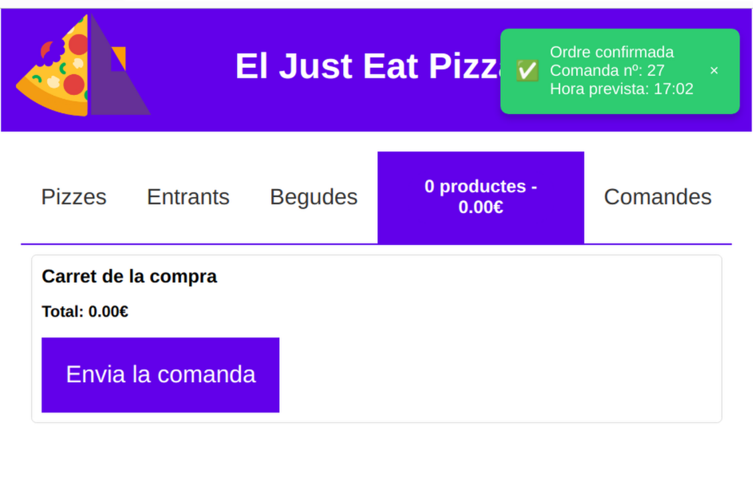

# Sprint 4. Noves funcionalitats. Enunciat

Se'ns demana afegir un parell de noves funcionalitats a la nostra aplicació per realitzar comandes on-line per a una pizzeria. Aquestes noves funcionalitats seran:

* Incorporar la possibilitat de demanar begudes, a través d'una pestanya, igual que es fa amb les pizzes i els entrants.
* Una vegada es tinga tota la comanda, s'envia aquesta al servidor, qui processarà la petició i retornarà una confirmació amb l'hora estimada d'arribada de la comanda. L'aplicació guardarà un registre de les comandes realitzades.

A continuació es comenten alguns detalls sobre aquests dos requeriments:

## Demanar begudes

L'equip de disseny ens proporciona el següent mockup de com quedaria una vista amb la informació sobre les begudes.

{width=400px}

La informació sobre les begudes s'obtindrà del servidor `https://pizza-rest-server-production.up.railway.app/api/pizzeria/beguda` (això ara és irrellevant), i cada beguda contindrà informació com la següent:

```json
{
  "id": "cola0",
  "nom": "Coca Cola Zero 33 cl",
  "preu": 1.6,
  "sucre": false,
  "cafeina": true,
  "alcohol": false
}
```

El funcionament serà semblant al que tenim en pizzes i entrants, de manera que el elient podrà afegir o eliminar begudes al carret.

## Processament de la comanda

Una vegada realitzada, el client podrà enviar la comanda a la pizzeria. Per a això disposarà d'un botó a la part inferior d'aquesta:

{width=400px}

Quan la petició s'envie, poden passar dues coses, o bé que es produisca algun error (cosa que s'haurà de considerar en l'app client):

{width=400px}

O bé que la petició tinga èxit. En aquest cas, el servidor ens retornarà una resposta amb el format:

```json
{
    "confirmed":true,
    "time":"17:02",
    "order":27
}
```

Mostrant que la petició és confirmada, el número de comanda (`order`), i l'hora prevista d'arribada (`time`).

Aquesta es mostrarà a l'usuari amb un missatge:

{width=400px}

En cas que es detecte un error en el servidor, el missatge que retornarà contindrà:

```json
{
    "confirmed":false,
    "message":"Missatge d'error"
}
```

Finalment, una vegada la comanda s'ha enviat, s'esborra el contingut del carret, i s'afegirà la comanda a l'històric de comandes, que es podrà consultar des d'una altra pestanya, amb el següent aspecte:

{width=400px}

Com veiem, consisteix en una *Card* amb el número de comanda, l'hora d'arribada i la llista de productes de l'encàrrec.

## Requeriments

Es demana:

1. Ampliació del diagrama de casos d'ús, contemplant els anteriors
2. Especificació dels requisits funcionals per als dos casos anteriors (nom, actors, descripció, precondicions, postcondicions, flux principal i fluxos alternatius/excepcions)
3. Ampliació del diagrama de classes, incorporant noves classes i les modificacions que puguen haver en altres classes.
4. Diagrames de seqüència per a cada operació

## Estat actual del sistema

A mode d'exemple, veiem els diagrames UML més representatius del què tenim fins a l'sprint 3.

## Diagrama de casos d'ús


## Diagrama de classes


## Diagrama de seqüència d'exemple (afegir entrant)


## Diagrama de components


[Ves a la solució!](Sprint4_Solucio.md)

