# Diagrames de casos d'ús

Els diagrames de casos d'ús són els diagrames més coneguts d'UML i representen els diferents actors externs que interactuen amb el sistema d'informació, i a través de quines funcionalitats (casos d'ús o requeriments funcionals) es relacionen amb ell.

És a dir, aquests diagrames **ens mostraran de manera visual les diferents funcions que pot realitzar cada tipus d'usuari d'un sistema d'informació**.

Les finalitats dels diagrames de casos d'ús poden ser diverses, i entre elles podem trobar:

* Representar els *requeriments funcionals* del sistema (què volem que faça).
* Representar els *actors* que es comuniquen amb el sistema. Aquests actors seran bé usuaris (perfils d'usuaris més concretament) o altres sistemes externs.
* Representar la relació entre els *requeriments funcionals*  i els *actors*.
* Guiar el desenvolupament del sistema, donant-nos un punt de partida sobre què començar a desenvolupar.
* Facilitar la comunicació precisa entre client i desenvolupador, simplificant la forma en què tots puguen participar en l'elaboració dels requeriments del sistema, inclosos els clients.

# Elements d'un diagrama de casos d'ús

Els diagrames de casos d'ús es componen de tres elements principals: els actors, els casos d'ús i les relacions.

## Actors

Els actors són entitats, ja siguen persones o no, externes al sistema, i que interactuen amb ell de forma directa. Aquesta interacció es tradueix en que aporten o reben informació, que realitzen una acció, etc.

Els actors es representen de forma senzilla com un *monigot* (no he trobat altra definició més clara), amb el nom de l'actor al davall:

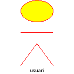{ width=100px }

Com hem dit, distingim dos tipus d'actors: usuaris i sistemes. A més, els usuaris no són usuaris concrets, sinó tipus, rols o perfils d'usuari (usuari, administrador, gerent, gestor, etc.). Pel que fa als actors que són sistemes, aquests poden ser, per exemple, sistemes de gestió de bases de dades o el sistema de fitxers on emmagatzemem informació. En ocasions, quan es tracta d'actors que són *altres sistemes*, no s'utilitza la notació del *ninot*, per ser poc intuïtiva.

**Representació d'actors en Mermaid i PlantUML**

En Mermaid i PlantUML representem els actors de la següent forma:

- **Mermaid**:

````markdown
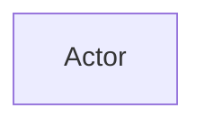
````


- **PlantUML**

````markdown
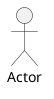
````


## Casos d'ús

Un cas d'ús **representa una funcionalitat (*o unitat de funcionalitat completa*) que realitza el sistema**, i es tracta d'una seqüència d'accions que fa el sistema i que produeixen un resultat que puga percebre i siga d'utilitat per a algun dels actors.

La seua representació gràfica és una el·lipse, amb el nom del cas d'ús a dins. Com hem dit, són accions que realitzarà el sistema; alguns exemples poden ser:  "Realitzar Comanda", "Llistar productes", "Enviar missatge".

Abans de l'especificació d'UML 2.5 els casos d'ús els havia d'invocar un actor. A partir de la versió 2.5, es contempla que algunes funcionalitats del sistema les inicie el propi sistema, i al mateix temps, oferisca resultats útils al client (per exemple, accions periòdiques que realitze el sistema de forma automàtica, com comprovar si hi ha correus nous o actualitzar informació meteorològica).

**Casos d'ús en Mermaid i PlantUML**

- **Mermaid**

````markdown
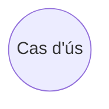
````


- **PlantUML**:

````markdown
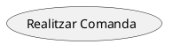
````


## Relacions

Les relacions **connecten els casos d'ús amb els actors, o els casos d'ús entre si**.

Aquestes *connexions* representen la interacció entre l'actor i el cas d'ús, i sol representar-se amb una línia contínua amb la identificació `<<comunicates>>`.

Quan connectem casos d'ús entre ells podem diferenciar dos tipus de relacions: `<<include>>` i `<<extend>>` (o bé les traduccions `<<usa>>` i `<<estén>>`):

* `<<include>>`: Indica que un cas d'ús utilitza sempre altre cas d'ús obligatòriament. Es representa amb una fletxa discontínua, que va des del cas d'ús d'origen al cas d'ús que s'inclou.

* `<<extend>>`: S'utilitza quan un cas d'us té un comportament opcional que està contemplat en altre cas d'ús. Es representa amb una fletxa discontínua, des del cas d'ús opcional a l'original.

A més, hi ha altre tipus de relació anomenada *generalització*, consistent a que un element hereta el comportament d'un altre. Tot i que podem utilitzar-ho en casos d'ús, el més habitual és fer-ho entre actors, per exemple, per indicar que un usuari administrador d'una aplicació també pot ser usuari corrent, i heretar les funcionalitats d'aquest.

**Relacions en Mermaid i PlantUML**

**Mermaid**

Mermaid no disposa d'elements específics pe a expressar relacions entre actors i entitats, sinò que fa ús de connexions. 

* Per tal d'indicar una fletxa contínua, quan un *Actor* es relaciona amb un cas d'ús, fem ús de `-->`.
* Per tal d'indicar fletxes discontínues entre casos d'ús fem ús de `-..->`. 
* A més, a dins la fletxa podem incorporar anotacions, que en el cas de les relacions entre casos d'ús ens serviran per indicar el tipus, si és *use*, *extends* o *include*, amb `-.use.->`, `-.extend.->` i `-.use.->` (sense espais).


Veiem un exemple:

````markdown
```mermaid
graph LR
    Actor --> Cas1((Cas d'ús 1))
    Cas1 - .include.-> Cas2((Cas d'ús 2))
    Cas3((Cas d'ús 3)) - .extend.-> Cas2
```
````

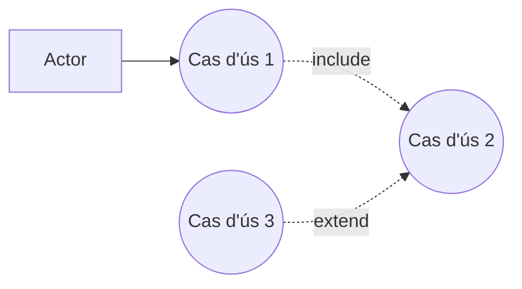

PlantUML, per la seua banda, sí que aporta una major riquesa expressiva. En aquest cas:

* Les relacions entre actors i casos d'ús s'expressen amb `-->`.
* Les relacions entre casos d'ús, si són d'inclussió (*includes*) s'expressen amb `.>`. A més, podem afegir al final l'etiquea `<<include>>`, per indicar que un cas d'ús sempre utilitza un altre cas d'ús com a part del seu comportament.
* Les relacions d'extensió (*extends*) entre casos d'ús s'expressen amb `..>`. A més, podem incloure l'etiqueta `<<extends>>` al final.

````markdown
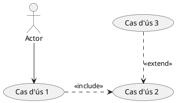
````


## Exemple: Un carret de la compra

El següent diagrama de casos d'ús mostra els elements vistos anteriorment en el context d'una aplicació típica de *carret de la compra* en una plataforma de compres *on-line*.

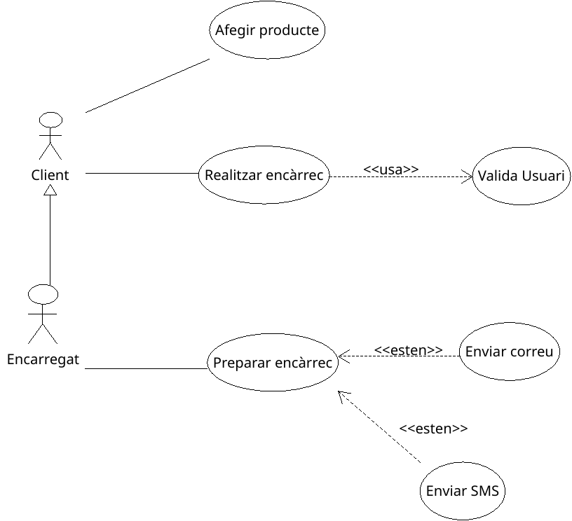{ width=400px }

Com veiem, tenim dos classes d'actors: `Client` i `Encarregat`, sent el segon un cas especial del primer, ja que un encarregat de la plataforma pot ser també un client.

Pel que fa als casos d'ús *associats* al *client*, se'ns mostren dos:
* `Afig producte` *al carret de la compra*, i
* `Realitza encàrrec`, una vegada el client té el carret preparat. Per tal de poder realitzar efectivament l'encàrrec, cal que el client es valide de nou, pel que aquest cas d'ús fa ús (`<<includes>>`) del cas `Valida usuari`.

Per la seua banda, l'actor *Encarregat*, té associat el cas d'ús:

* `Preparar Encàrrec`, que requerirà, una vegada s'envie el paquet a l'usuari notificar aquest bé a través de correu electrònic o bé pe SMS. Per a això, apareixen dos casos nous d'ús `Enviar correu` i `Enviar SMS`, que seran opcionals (`<<extend>>`).

### Exemple amb Mermaid

Veiem aquest mateix exemple com es podria expressar amb Mermaid:

````markdown
```mermaid
graph LR
    Client[Client] --> AfigProducte((Afig producte))
    Client --> RealitzaEncarrec((Realitza encàrrec))
    Encarregat -..->|Generalització| Client
    RealitzaEncarrec - .include.-> ValidaUsuari((Valida usuari))

    Encarregat[Encarregat] --> PrepararEncarrec((Preparar encàrrec))
        EnviarCorreu((Enviar correu)) --.extend.-> PrepararEncarrec
    EnviarSMS((Enviar SMS)) - .extend.-> PrepararEncarrec
```
````

Com veiem, *Mermaid* defineix el diagrama com un diagrama de Flux (`graph`), ja que no disposa d'un tipus de diagrama específic per a casos d'ús.

En aquest diagrama, els nodes defineixen tant els actors com els casos d'ús, i es distingeixen pel seu estil visual, de la següent manera:

* Els nodes que defineixen un actor s'expressen com a `Actor[Actor]`. El primer element d'aquests és l'identificador del node, mentre que el segon, defineix l'estil visual, que en aquest cas és un rectangle.
* Per la seua banda, els casos d'ús s'expressen amb la notació `Cas((Cas))`, on `Cas` és l'identificador i `((Cas))` defineix l'estil visual com una el·lipsi.

Pel que fa a les connexions:

* Les fletxes `-->` indiquen connexions contínues entre nodes, i es mostraran com línies contínues.
* Les fletxes `-.->` i `-..->` es mostren com línies discontínues i expressen connexions entre nodes i generalitzacions. A més, en les línies discontínues, entre els punts, podem indicar etiquetes, per especificar el tipus de relació (`-.include.->`)

El reultat d'aquest diagrama serà el següent:

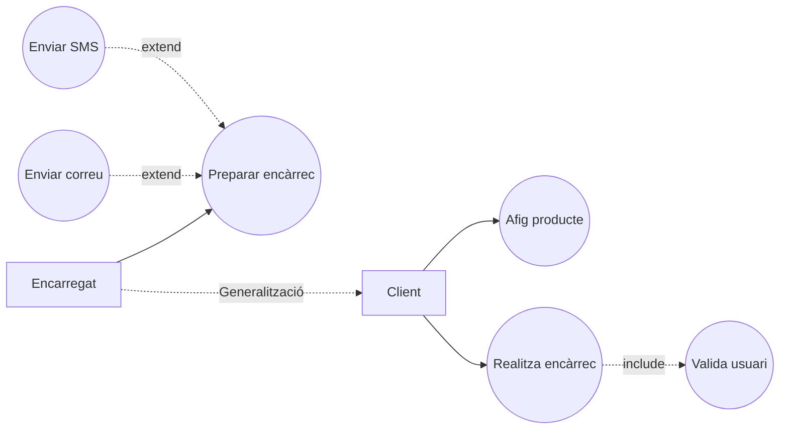

### Exemple amb PlantUML

Amb PlantUML el diagrama de casos d'ús s'expressaria així:

````markdown
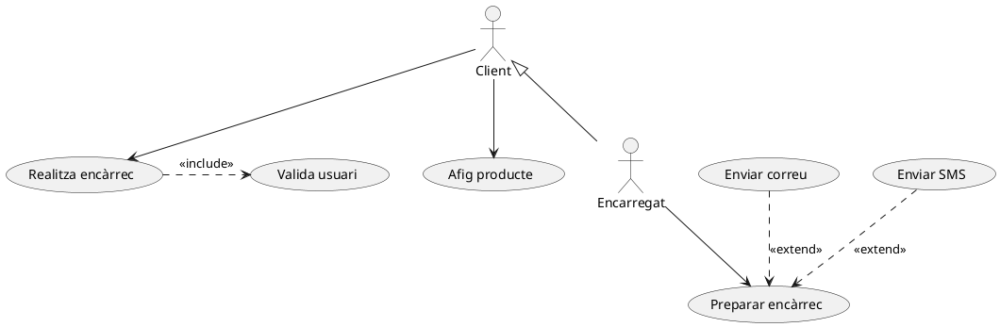
````

Veiem els aspectes més rellevants de la sintaxi utilitzada aci:

* `@startuml` i `@enduml`: indiquen l'inici i el final del diagrama.
* Definim els actors tancant l'identificador entre dos signes de dos punts, com `:Client:`.
* Els casos d'ús es defineixen entre parèntesis: `(Enviar SMS)`
* Les relacions s'expressen amb fletxes, seguint el següent esquema:
* 

| Fletxa | Significat | Exemple |
|------|----|--|
  | `-->` | Connexió directa o associació entre un actor i un cas d'ús.      | `:Client: --> (Afig producte)` |
  | `.>` | Relació `<<include>>` entre casos d'ús.  |`(Realitza encàrrec) .> (Valida usuari) : <<include>>` |
  | `..>` | Relació `<<extend>>` entre casos d'ús. | `(Enviar correu) ..> (Preparar encàrrec) : <<extend>>` |
  | `<\|--` | Generalització entre actors o casos d'ús. | `:Encarregat: <\|-- :Client:`|

El resultat serà el següent:


A més, també podriem expressar el diagrama de la següent manera, definit primer els actors i casos d'ús amb `actor` i `usecase`i utilitzar Alias (`as`), i posteriorment, definir les relacions fen ús d'aquests àlias:

````markdown
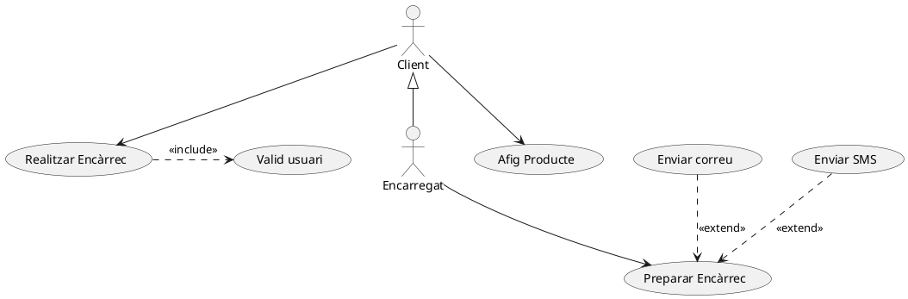
````

Això ens permet, a més, definir agrupacions d'actors o casos d'ús, per exemple:

````markdown
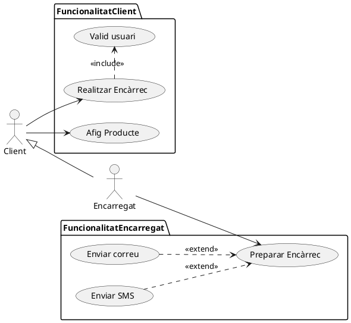
````

Com veiem, hem fet ús de `package {...}` per agrupar casos d'ús, i distingir la funcionalitat del client i la de l'encarregat en paquets diferents.

A més, també hem fet ús de la directiva `left to right direction`, que intenta dibuixar els diferents elements d'esquerra a dreta.

El resultat és aquest:

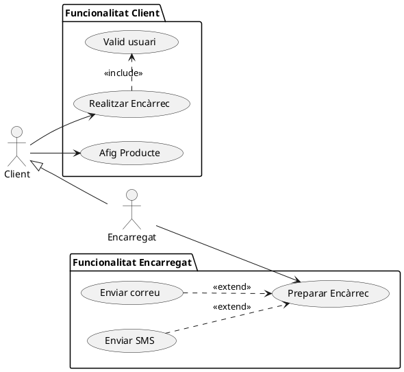

!!!note "Més informació..."
    * Al lloc web de *DiagramasUML* podeu trobar una guia per tal d'identificar possibles actors i casos d'ús d'un sistema: [https://diagramasuml.com/identificar-actores-y-casos-de-uso/](https://diagramasuml.com/identificar-actores-y-casos-de-uso/).
    * La [documentació oficial de PlantUML](https://plantuml.com/use-case-diagram) ens ofereix informació molt més detallada i completa sobre la creació de diagrames de casos d'ús.

# Descripció dels requeriments funcionals i no funcionals

Quan definim els casos d'ús, és habitual descriure cada cas d'ús com una seqüència de passos que cal fer per completar-lo, i les possibles excepcions que poden haver.

Per a cada cas d'ús, tindrem un document, en forma de taula on es plasmen els diferents requeriments d'aquest. Aquests requeriments podran ser **funcionals** i **no funcionals**. 

!!!note "Requisits funcionals i no funcionals"
    Els **requisits funcionals** descriuen les accions o funcions que el sistema ha de ser capaç de realitzar per satisfer les necessitats dels usuaris, com afegir productes al carret o enviar notificacions.
    Els **requisits no funcionals** fan referència a les especificacions de qualitat o limitacions que afecten el rendiment, la seguretat, la usabilitat o altres aspectes operatius del sistema, com la velocitat de resposta o el nivell de seguretat requerit. Per exemple, podría ser que les transaccions i les comunicacions de xarxa es realitzaren de forma segura.

A més dels requeriments, en la descripció dels casos d'ús podem tindre la següent informació:

* **Identificador i nom descriptiu**
* **Descripció** del cas d'ús
* **Actors implicats**
* **Precondicions**: Expressem en llenguatge natural les condicions necessàries per a que es puga realitzar el cas d'ús.
* **Seqüència normal** de les interaccions del cas d'ús. En cada pas, l'actor o el sistema realitzarà una o més accions, o es realitzarà altre cas d'ús.
* **Postcondició**: Expressem en llenguatge natural les condicions que s'han de complir després de finalitzar el cas d'ús de forma normal.
* **Excepcions**: Especifica el comportament del sistema en cas que es produïsca una situació excepcional en algun pas.

## Exemple

* **Cas d'ús**: RF01
* **Nom**: Realitza encàrrec
* **Actors**: Usuari
* **Descripció**:
    L'usuari finalitza l'encàrrec per iniciar el seu procés de preparació
* **Precondicions**:
    S'ha de tractar d'un usuari del sistema, i el carret ha de tindre algun article
* **Seqüència normal**:
  1. El sistema comprova que el carret continga articles
  2. Es valida l'usuari a través del cas d'ús corresponent
  3. S'emmagatzema l'encàrrec a la base de dades.
* **Postcondicions**
    S'ha generat un nou registre en la base de dades amb l'encàrrec
* **Excepcions:**
    * 1.1. Si el carret està buit, es mostra un missatge d'error a l'usuari.
    * 2.1. Si la validació no es correcta es mostra un missatge d'error i no es continua.
    * 3.1. Si es produeix algun error en l'emmagatzemament s'informa a l'usuari i es genera un registre d'error.
* **Requisits no funcionals**:
    * Les connexions han de ser segures, utilitzant protocols com HTTPS.
    * El temps de resposta del sistema per emmagatzemar l'encàrrec no ha de superar els 2 segons en condicions normals.
    * Els missatges d'error han de ser clars i comprensibles per a l'usuari final.

# Dibuixant diagrames de casos d'ús

A l'hora de dibuixar casos d'ús seguirem un raonament guiat pels següents passos:

1. Identificar **fonts d'informació**, preguntant-nos d'on prové la informació que utilitzarà el sistema.
2. Identificar **actors potencials**, com els *usuaris* i *serveis* que utilitzaran el sistema,
3. Identificar possibles **casos d'ús**, preguntant-nos quins serveis utilitzaran els actors,
4. **Associar actors i casos d'ús**, de manera que determinem quins actors tindran accés a quines funcionalitats del sistema,
5. Determinar **a quin o què representen els actors**, 
6. Buscar *més casos d'ús*,
7. **Documentar** detalladament cada cas d'ús,
8. Determinar **relacions entre els difernts casos d'ús** i identificar accions que es realitzen repetidament.
9. **Comprovar** la vista general per a que tot estiga correcte.

Recordeu que per optimitzar aquest procés cal comprendre bé el negoci i el sistema, i sovint haurem de fer partíceps en l'elaboració dels casos als clients, experts o consultors del negoci.

# Exercicis

A continuació se us proposen un parell d'especificacions textuals, que podriem haver extret d'entrevistes o correus amb un posible client. 

A partir d'aquestes especificacions, haureu de generar el diagrama de casos d'ús, seguint els pasos indicats anteriorment i com documentar aquests. Concretament, per a cada cas d'ús es demana:

* Identificar actors principals i secundaris (usuaris finals, administradors, sistemes externs...).
* identificar els casos d'ús
* Dissenyar els diagrames de casos d’ús per a cada especificació (al menys un disseny amb Umbrello i altre amb PlantUML)
* Establir relacions com << include >> i << extend >> on siga necessari.
* Especificar els requeriments funcionals i no funcionals en taules associades als casos d'ús.

!!! note "Especificació 1: Gestió d'una biblioteca digital"
    Voldríem una aplicació que permeta als usuaris buscar i demanar llibres en format digital o físic. Els administradors del sistema haurien de poder gestionar el catàleg, afegint o eliminant llibres, i gestionar també les sol·licituds de préstec. Els usuaris que s'hagen registrat poden veure l'historial de préstecs i descarregar llibres digitals. Les connexions amb el sistema han de ser segures, i el temps de resposta ha de ser ràpid, ja que els usuaris no tenen molta paciència.

!!! note "Especificació 2: Sistema de reserva d'entrades per a esdeveniments"
    Necessitem una plataforma en línia per a la compra i reserva d'entrades per a esdeveniments culturals i esportius. Els usuaris registrats han de poder veure els esdeveniments disponibles, reservar entrades i veure les reserves al seu perfil. Els organitzadors d'esdeveniments han de poder publicar nous esdeveniments, actualitzar-ne els detalls i consultar estadístiques de vendes. A més, volem que el sistema notifique als usuaris per correu electrònic quan un esdeveniment canvie de data o de localització.

!!! note "Especificació 3: Aplicació de gestió de comandes en un restaurant"
    Estem buscant una aplicació que permeta als cambrers gestionar les comandes de les taules. Cada cambrer ha de poder assignar una comanda a una taula, afegir o eliminar plats, i finalitzar la comanda per enviar-la a la cuina. A la cuina, el sistema ha de mostrar les comandes pendents i permetre marcar-les com a preparades. També volem que l’aplicació genere automàticament la factura per a cada taula i permeta als cambrers cobrar. És important que l'aplicació funcione bé en dispositius mòbils.