# Diagrames estructurals i el diagrama de classes

Els diagrames estructurals o d'estructura són aquells que **representen l'estructura estàtica dels objectes del sistema**. Entre ells, el diagrama de classes és el més conegut i utilitzat.

El diagrama de classes és un diagrama purament orientat al model de programació orientat a objectes, ja que defineix les classes que s'utilitzaran i la manera en què es relacionen entre elles. Com veurem, s'assembla molt al diagrama Entitat-Relació (E/R), amb la diferència que el diagrama de classes també representa la funcionalitat que ofereixen les classes. Ambdós són models de dades lògics d'un sistema.

# Elements d'un diagrama de classes

El diagrama està format principalment per *classes* i les *relacions* entre elles, així com per *interfícies*. Veiem cadascuna d'elles.

!!! note "Conceptes sobre POO"
    Abans d'endinsar-nos en el disseny i la creació de diagrames de classes, anem a fer una introducció molt breu als diferents conceptes que tractarem.

    * **Objectes**
       * Un objecte és una entitat amb certes **propietats o atributs**, els valors de les quals detrminen el seu **estat**, i determinat **comportament**, determinat per una sèrie de funcions que coneixem com **mètodes**.
       * Un objecte, a més, té un nom pel qual s'identifica.
       * A més, cada objecte té una identitat única, la qual permet diferenciar-lo d'altres objectes, encara que tinguen els mateixos valors (estat) als atributs.
       
    * **Classes**
       * Una classe és una abstracció d'un conjunt d'objectes, i un objecte ha de pertànyer neccessàriament a alguna classe. Quan definim una classe hem de definir els atributs i mètodes que posseïran els objectes.d'aquesta.
       * Diem que un objecte és una **instància** d'una classe.  
  
## Representació de Classes

Les classes són l'element principal del diagrama i representen, com el seu nom indica, una classe dins del paradigma d'orientació a objectes. Normalment s'utilitzen per a **representar conceptes** o **entitats del *negoci***.

Una classe **defineix un grup d'objectes que comparteixen característiques comunes**. La manera més ràpida per a trobar classes sobre un enunciat o en general, sobre un tema concret és *buscar els substantius que apareixen en aquest*. Per exemple: *Persona*, *Missatge*, *Producte*, etc.

Una classe es compon de tres elements o seccions principals:

* El **nom de la classe**,
* Els **atributs** o **propietats**, que són variables associades a la classe i representen la part estàtica d'aquesta,
* Els **mètodes**, que són funcions associades a la classe, i representen la seua part dinàmica.

La representació d'una classe és una caixa dividida en tres zones, de la següent manera:

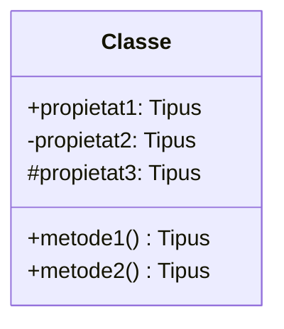

* A la part superior s'indica **el nom de la classe**. Si es tracta d'una classe *abstracta* (és a dir, no es pot instanciar directament, sinó que serveix per definir altres classes), aquest nom s'indica *en cursiva*.
* La part central conté els atributs de la classe, un per línia i amb els següents formats:

```text
visibilitat nom_atribut : tipus = valorInicial { propietats }
```

```text
visibilitat nom_atribut : tipus
```

* La zona inferior, finalment, inclou els mètodes de la classe, i s'expressen de forma semblant:

```text
visibilitat nom_mètode { *paràmetres } : TipusRetorn { propietats }
```

```text
visibilitat nom_mètode: TipusRetorn
```

Els atributs i mètodes tenen un tipus de dada (el tipus de dada de l'atribut, i el tipus de dada que retorna, en cas dels mètodes), així com una visibilitat o nivell d'accés, que determina qui pot o no accedir a ells.

!!! note "Sobre la visibilitat o el nivell d'accés a atributs i mètodes"

    La visibilitat de propietats o mètodes ens ajuda a protegir i encapsular aquests, de manera que puguem decidir qui accedeix o no a aquestes. La visibilitat pot ser:

     * **public**: L'atribut o mètode és accessible des de qualsevol lloc de l'aplicació.
     * **privat**: L'atribut o mètode només és accessible dins la mateixa classe.
     * **protegit**: L'atribut o mètode només és accessible dins la mateixa classe o les seues *classes derivades*.

    Habitualment, per tal d'aprofitar els beneficis de l'encapsulament i aïllament de codi que proporciona la programació orientada a objectes, els atributs es solen declarar com a *privats*, i només en cas que es permeta l'accés a ells des de fora, es farà a través de *mètodes públics*. Aquests mètodes es coneixen com *setters* (estableixen el valor d'un atribut) i *getters* (consulten el valor d'un atribut) o mètodes *accessors*.

    Els mètodes serviran per comunicar-nos amb els objectes i interactuar amb ells, a través de **missatges**, que no és més que la invocació als seus mètodes.

Als diagrames UML, expressem la visibilitat amb:

* **(+)**: Per definir una propietat o mètode com a **pública**
* **(-)**: Per definir una propietat o mètode com a **privada**
* **(#)**: Per definir una propietat o mètode com a **protegida**

!!! note "Dependència del llenguatge en la visibilitat i orientació a objectes"
    Els conceptes de **public**, **private** i **protected** són característics de molts llenguatges orientats a objectes, com ara **Java**, i estan directament suportats per aquests llenguatges. Per exemple, Java permet declarar explícitament la visibilitat dels atributs i mètodes d'una classe i proporciona mecanismes com els *setters* i *getters* per a implementar l'encapsulament. 

    Altres llenguatges no implementen aquestes característiques directament, però ofereixen altres mecanismes semblants. Al cas de Javascript per exemple, des de la versió ES11 (de 2019), podem fer ús de `#` mer marcar atributs i mètodes privats.

### Com expressar una classe en PlantUML i Mermaid**:

La sintaxi per expressar classes en PlantUML és la següent:

````markdown
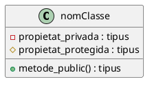
````

Que ens genera el següent diagrama:


Observeu com es marquen amb un quadre roig els components privats, amb un romb groc les protegits, i amb un cercle verd els públics.


Per la seua banda, amb Mermaid, ho expressariem així:

````markdown
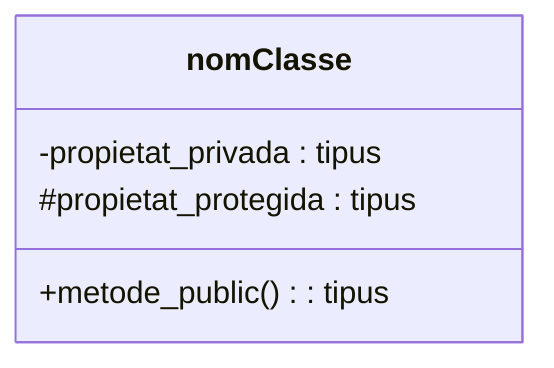
````

Que queda represenat així:


Veiem un exemple que podria representar un objecte tipus Nau en un videojoc:

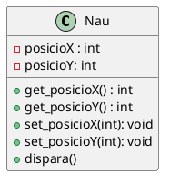

Com veiem, es tracta d'una classe `Nau`, amb dos atributs privats: `posicioX` i `posicioY`. Per tal d'accedir a ells, es disposa dels mètodes `getPosicioX()` i `getPosicioY()`. A més, la classe defineix el mètode `dispara()`.


#### Propietats i mètodes estàtics

Un atribut o mètode **estàtic** és aquell que **ressideix en la classe**, i no ens els objectes que s'instancien d'ella.

En UML ho remarquem subratllant l'atribut o mètode en qüestió.

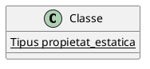

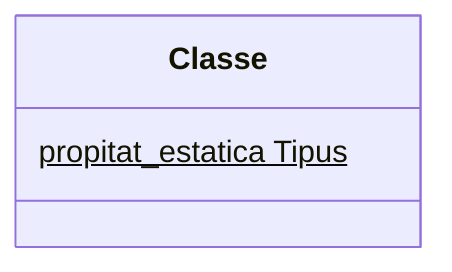


### Classes en acció en Java i Javascript

#### Java

La traducció a Java de la classe *Nau* anterior seria literal, incloent els atributs i mètodes corresponents, a més del mètode ***constructor***:

```java
public class Nau {

  /* Atributs */
  private int posicioX;
  private int posicioY;
  
  /* Constructor */
  public Nau () { };
  
  /* Mètodes d'accés */

  public void setPosicioX (int valor) {
    posicioX = valor;
  }

  public int getPosicioX () {
    return posicioX;
  }

  public void setPosicioY (int valor) {
    posicioY = valor;
  }

  public int getPosicioY () {
    return posicioY;
  }

  /* Altres mètodes */
  public void dispara() {
    ...
  }
}
```

**Instanciació**

La instanciació és el procés pel qual creem un nou objecte a partir d'una classe. Per a això fem ús de l'operador `new`:

```java
Nau AlaX=new Nau();
Nau TieFighter=new Nau();
```

Quan fem ús de `new` per obtenir una instància d'una classe (és a dir, per crear un objecte), s'executa un mètode especial de la classe, anomenat mètode **constructor**, que s'encarrega generalment d'inicialitar l'objecte. Tota classe hauria de tindre, com a mínim, un constructor (aquest mètode sol ometre's als diagrames UML per ser obvi).

En Java, el mètode **constructor** té el mateix nom que la classe, i pot ser un mètode ***sobrecarregat***. Això significa que podem tindre definit el mètode diverses vegades, sempre que tinga una llista d'arguments diferent. 

Quan una classe no requereix de cap inicialització per instanciar-se, com és el cas anterior, el constructor pot ometre's, de manara que Java afig un **constructor per defecte**.

Als diagrames UML, no sol indicar-se el constructor, ja que assumim que tot objecte posseeix un mètode constructor. Ara bé, en cas que volguem inicialitzar els objectes d'alguna manera especial i sobrecarregar el constructor, es podrien incloure aquests constructors.

En cas que volguem afegir més constructors sobrecarregats, però també volguem proporcionar un constructor sense arguments, caldrà indicar-los tots de manera explícita. A l'exemple anterior, podriem haver definit els constructors com a:

```java
public class Nau {
  ...

  /* Constructor buit. 
     Necessari si volem instanciar sense proporcionar arguments */
  public Nau () { };

  /* Constructor sobrecarregat 
     Crea una nau amb valors inicials per a la posició
  */
  public Nau (int x, int y) {
    this.posicioX=x;
    this.posicioY=y;
   };
   ...
}
``` 

!!! question "Questió..."
     **Si definim el següent:**

     ```java
     Nau nau_1=new Nau(10,10);
     Nau nau_2=new Nau(10,10);
     ```

     **Estem definint dues vegades el mateix objecte?**

      La resposta és que NO. Cada objecte té una identitat pròpia, i s'emmagatzema en una variable diferent. És més, cada objecte ocupa una direcció de memòria diferent.

     Si comparàrem els dos objectes `nau_1==nau_2`, obtindriem *Fals* com a resposta.

     Moltes classes solen implementar un mètode `equals` per comparar un objecte amb altre, de manera que internament, comparen el valor dels diferents atributs i determinen si són els mateixos o no.

En Java, les classes també permeten un modificador d'accés. Aquest pot ser:

* ***public***: Classe pública, accessible des de qualsevol altra classe. Només pot haver una classe pública en cada fitxer font (ext .java), i ha de tindre el mateix nom que el fitxer. Si no indiquem res, la classe només podrà ser accedida des del mateix paquet (package).
* **abstract / final**: S'utilitzen quan fem ús de l'herència:
    * ***abstract***: La classe no permet la instanaciació d'objectes, sinò la definició d'altres classes que implementen mètodes que aquesta defineix com a abstractes.
    * ***final***: Classe que implementa els mètodes abstractes, i de la que no es podran crear subclasses.

#### Javascript

La traducció a Javascript de la classe *Nau* seria així:

```javascript
class Nau {
// Atributs privats
  #posicioX; 
  #posicioY;

  constructor(x = 0, y = 0) {
    this.#posicioX = x;
    this.#posicioY = y;
  }

  // Getters
  get posicioX() {
    return this.#posicioX;
  }

  get posicioY() {
    return this.#posicioY;
  }

  // Setters
  set posicioX(valor) {
    this.#posicioX = valor;
  }

  set posicioY(valor) {
    this.#posicioY = valor;
  }

  dispara() {
    
  }
}
```

I podríem instanciar aquesta, per exemple amb:

```javascript
const nau = new Nau(10, 10);
```

En primer lloc, fixem-nos en la forma de declarar i accedir a les propietats `#posicioX` i `#posicioY`. Amb el símbol `#` al davant estem indicant que es tracta de propietats privades, de manera ue només poden ser accessibles des de dins de la classe.

Observeu també, que en aquest cas, els `getters` i `setters` són funcions que tenen al davant la paraula clau `get` o `set`. Això ens permetrà accedir a ells com si es tractara de propietats públiques. És a dir, que podem fer coses com:

```js
console.log(nau.posicioX)
```

```js
nau.posicioY=15
console.log(nau.posicioY)
```

I finalment, observeu que el constructor ara és únic, i defineix valors per defecte per a les propietats. D'aquesta manera, si el constructor s'invoca sense arguments:

```
const nau3=new Nau()
```

El valor de les seues propietats serà l'indicat per defecte (0,0).

!!!question "Questió"

     Si definim així la nau:

     ```js
     class Nau {
        // Atributs privats
          #pos_x;
          #pos_y;

        constructor(x = 0, y = 0) {
          this.#pos_X = x;
          this.#pos_Y = y;
        }

        // Getters
        get posicioX() {
          return this.#pos_X;
        }

        get posicioY() {
          return this.#pos_Y;
        }

        // Setters
        set posicioX(valor) {
          this.#pos_X = valor;
        }

        set posicioY(valor) {
          this.#pos_Y = valor;
        }
      }
     ```

     Podrem fer, per exemple `console.log(posicioX)`? I `posicioY=20`?


!!! note "Generació automàtica de codi"
    Cal tindre en compte que quan utilitzem eines CASE que ens ajuden a crear el codi a partir dels diagrames, és possible que ens generen automàticament els mètodes *accessors* als atributs, de manera que no siga necessari incloure'ls al diagrama.

!!!note "A tindre en compte..."
    Com hem vist, hem de tindre en compte que la sintaxi, tant per definir les classes com els mètodes accessors i altres característiques dependrà en gran mesura del llenguatge de programació que escollim, i fins i tot, potser hi haja alguns aspectes que podem representar als diagrames UML que no es puguen veure reflexats en una implementació.

## Representació de Relacions

Les diferents classes que conformen una aplicació interaccionen entre elles, a través de diferents tipus de *relacions*. Generalment, les relacions seran entre dos o més classes, tot i que de vegades, una classe pot establir relacions amb ella mateixa (dependència *reflexiva*).

Per tal de representar una relació entre classes en un diagrama de classes fem ús d'una línia que les uneix. Aquesta línia serà diferent segons el tipus de relació.

Les relacions en el diagrama de classes tenen diverses propietats, que podrem representar més o menys segons el nivell de detall que volguem aportar. Aquestes **propietats de les relacions** són:

* **Multiplicitat**: Indica el nombre d'elements que participen en la relació. Pot ser un número, un rang.. Si es tracta d'un número qualsevol, podem utilitzar `*`o `n`.
* **Nom de l'associació**, que ens ajuda a entendre la relació entre les classes.

### Tipus de relacions

Les relacions, com hem dit poden ser de diferents tipus. En un diagrama de classes, podem trobar-nos els següents tipus de relacions:

* Associació.
* Agregació.
* Composició.
* Dependència.
* Herència.

Vegem cadascun d'aquests tipus de relacions.

#### Associació

És la relació més comuna i s'utilitza per a representar *dependència semàntica*, sense cap implicació de propietat. Es representa amb una simple línia contínua que uneix les classes que estan incloses en l'associació.

Veiem un exemple:

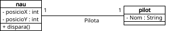

En aquest exemple, tenim definides dues classes: `Nau` i `Pilot`. La relació entre elles és que un `Pilot`, `Pilota` una `Nau`. Com veiem, la relació té una multiplicitat 1:1, és a dir, en un moment donat, un *pilot* està *pilotant* una nau, i una nau és *pilotada* per un pilot.

Tal i com l'hem expressada, es tracta d'una relació *bidireccional*. Això vol dir que des de `Nau`, podem *navegar* a `Pilot`, i a l'inrevès. En altres paraules, donada una nau podem saber qui la pilota, i donat un pilot podem saber quina nau pilota.

Aquestes relacions d'associació, també admeten **associacions unidirecconals**, que restringeixen la direcció de navegació. Per expressar això, farem ús d'una fletxa que indicarà el sentit d'aquesta associació:

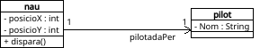

##### **Representació d'associacions en PlantUML i Mermaid**

- **PlantUML**:

````markdown
``` plantuml
  @startuml
  class Nau {
    -posicioX : int
    -posicioY : int
    +dispara() : void
  }

  class Pilot {
    -nom : String
  }

  Pilot --> Nau : pilota
  @enduml
  ```
````

I el resultat:

```plantuml
  @startuml
  class Nau {
    -posicioX : int
    -posicioY : int
    +dispara() : void
  }

  class Pilot {
    -nom : String
  }

  Pilot --> Nau : pilota
  @enduml
```

- **Mermaid**:

````markdown
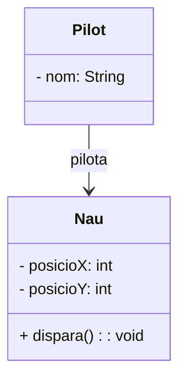
````


##### Aspectes sobre la implementació

Com hem comentat, les relacions són un concepte semàntic, i sovint no tenen una *equivalència* exacta quan ho passem a un llenguatge de programació. Per exemple... com expressaríeu les dues relacions anteriors amb Java? El mecanisme que tenim a Java (o altres llenguatges de programació) per *relacionar* classes és utilitzar les classes com a tipus de dades, i definir objectes d'aquest tipus dins d'altres. Com veurem, totes les relacions, quan les passem a Java es basaran en aquest mecanisme. Així doncs, per tal d'establir la relació direccional anterior amb Java, inclouriem un objecte de tipus *Pilot* dins la definició de *Nau*:

```java
/* Classe Pilot */

public class pilot {

  // Atributs
  private String Nom;
  
  // Constructor
  public pilot () { };
  
  // Mètodes accessors
  public void setNom (String newVar) {
    Nom = newVar;
  }

  public String getNom () {
    return Nom;
  }

}
```

```java
/* Classe Nau */
public class nau {

  // Atributs
  private int posicioX;
  private int posicioY;  
  private pilot pilotActual;
  
  // Constructor
  public nau () { };
  
  // Mètodes accessors
  public void setPosicioX (int newVar) {
    posicioX = newVar;
  }

  public int getPosicioX () {
    return posicioX;
  }

  public void setPosicioY (int newVar) {
    posicioY = newVar;
  }

  public int getPosicioY () {
    return posicioY;
  }

  public void setPilot (int newPilot) {
    pilotActual = newPilot;
  }

  public pilot getPilot () {
    return pilotActual;
  }

  // Altres mètodes
  public void dispara()
  {
  }

```

En cas que volguèrem que l'associació fora bidireccional, hauriem d'incloure també un objecte de tipus *Nau* dins de *Pilot*. L'inconvenient d'això és que caldria *programàticament* estar pedent de quan caviem aquesta associació que es modifiquen els dos objectes relacionats. En estos casos, el més pràctic serà determinar quin serà el sentit *normal* de les relacions, i fer ús d'associacions direccionals incloent només un objecte d'una classe dins l'altra. A l'exemple anterior, ens serà més útil conéixer quin pilot està pilotant una nau en un moment donat, que no quina nau pilota un pilot en un moment donat.

!!!question "Associacions amb multiplicitat N"
   Quan la multiplicitat de la relació és 1, hem vist que definim objectes d'un tipus dins d'altres. 

   Ara bé, com ho farem quan la relació té multiplicitat N?


#### **Agregació**

Les relacions d'agregació (*"té un"*) indiquen quan un objecte (el conjunt) està format per alters objectes. És a dir, una classe (el conjunt) està formada per altres classes (les parts), però aquestes poden existir independentment.

Per exemple, al cas de la nau, una nau pot estar formada per un propulsor, una cabina i un canó:

{ width=450px }

Com veiem, la forma de representar açò en Java, serà incorporar com a atributs tres objectes de tipus *Cabina*, *Propulsor* i *Canó* dins la classe *Nau*.

Veiem com expressar aquesta relació amb PlantUML i Mermaid:

- **PlantUML**: Fem ús de la notació `o--` per indicar que la classe de l'esquerra conté una instància de la classe de la dreta.

```markdown
  ``` plantuml
  @startuml
  class Nau {
    -propulsor : Propulsor
    -cabina : Cabina
    -cano : Cano
  }

  class Propulsor
  class Cabina
  class Cano

  Nau o-- Propulsor
  Nau o-- Cabina
  Nau o-- Cano
  @enduml
  ```
```

Que te la següent representació:

  ```plantuml
  @startuml
  class Nau {
    -propulsor : Propulsor
    -cabina : Cabina
    -cano : Cano
  }

  class Propulsor
  class Cabina
  class Cano

  Nau o-- Propulsor
  Nau o-- Cabina
  Nau o-- Cano
  @enduml
  ```

**Mermaid**: fa ús també de la seqüència `o--` per indicar l'agregació:

````markdown 
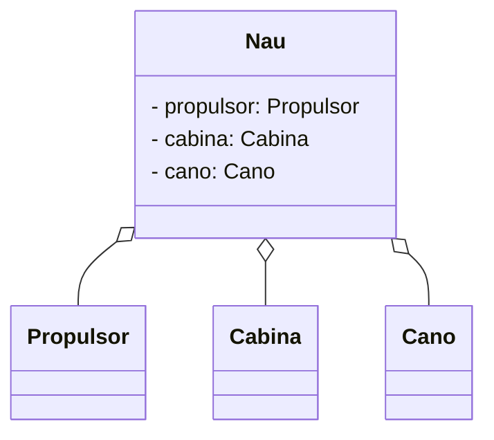
````

Que es representa:


#### **Composició**

Es tracta d'un cas especial d'agregació, però amb un valor semàntic més fort, on els elements que en formen part, no tenen sentit sense l'objecte que componen: Quan l'element compost desapareix, totes les seues parts desapareixen, ja que no tenen sentit per sí mateixos. A diferència també de l'agregació, en la composició, els elements components no es poden compartir entre diversos elements, mentre que en l'agregació el mateix objecte sí que pot estar compartit amb diversos elements.

La seua representació al diagrama de classes és amb una línia contínua amb un romble ple en la classe que és composta.

Per exemple, una partida d'un videojoc en línia serà la composició de diversos jugadors:

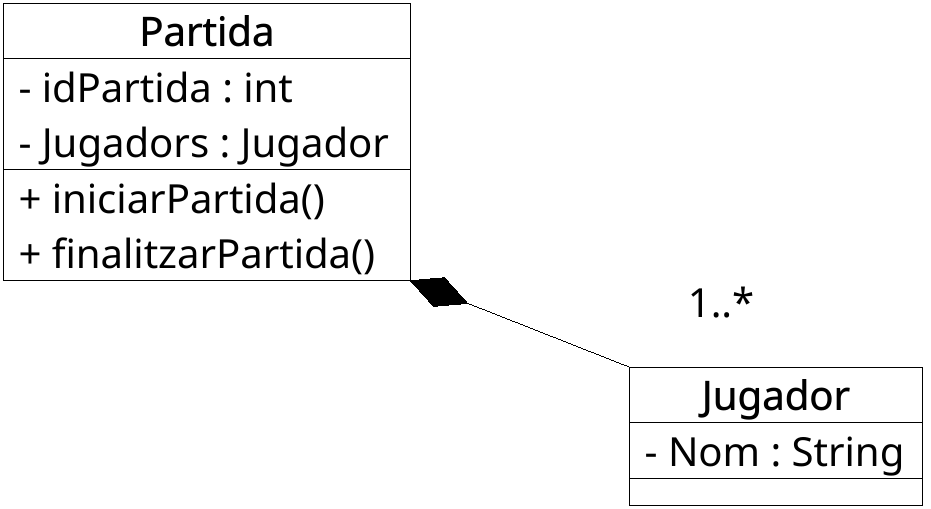{ width=250px }

Aquest diagrama indica que una partida està composada per diversos jugadors. En aquest cas, una vegada es finalitza i es destrueix una partida, els jugadors de la partida deixen de tindre sentit. Fixeu-vos que la multiplicitat de *Jugadors* és *un a molts*, el que vol dir que una partida tindrà entre un i diversos jugadors.

La diferència entre agregació i composició és semàntica, i  la majoria de llenguatges de programació, com és el cas de Java no diferencien entre elles.

##### Representació en Mermaid i PlantUML

En PlantUML i Mermaid fem ús de la seqüència de caracters `*--` per tal d'expressar una composició:

**PlantUML**:

````markdown
``` plantuml
  @startuml
  class Partida {
    -jugadors : Jugador[]
  }

  class Jugador {
    -nom : String
  }

  Partida *-- Jugador
  @enduml
  ```
````

  ```plantuml
  @startuml
  class Partida {
    -jugadors : Jugador[]
  }

  class Jugador {
    -nom : String
  }

  Partida *-- Jugador
  @enduml
  ```

**Mermaid**:

````markdown
```mermaid
  classDiagram
      class Partida {
          - jugadors: Jugador[]
      }

      class Jugador {
          - nom: String
      }

      Partida *-- Jugador
  ```
````

  ```mermaid
  classDiagram
      class Partida {
          - jugadors: Jugador[]
      }

      class Jugador {
          - nom: String
      }

      Partida *-- Jugador
  ```

!!!!note "Composicions en Java"
    Podeu veure una implementació d'aquest exemple en Java al document [Composicions en Java](./composicionsJava.md)

#### **Dependència**

La relació de dependència es dóna quan una classe requereix d'alguna funcionalitat d'altra classe. La seua representació és una fletxa discontínua, des de la classe que requereix la utilitat de l'altra fins la classe que la ofereix.

Un exemple de dependència podria ser el segïent:

![Representació d'una dependència](img/dependencia.png){

Com veiem, així expressem que la classe *Calculadora* depèn de la classe *Primes*, de la llibreria `org.apache.commons.math3.primes.Primes`.

##### Representació de dependència en PlantUML i Mermaid

En PlantUML:


````markdown
  ``` plantuml
  @startuml
  class Calculadora {
    +calculaPrimes() : void
  }

  class Primes

  Calculadora ..> Primes : utilitza
  @enduml
  ```
````

Es representa com a:

  ```plantuml
  @startuml
  class Calculadora {
    +calculaPrimes() : void
  }

  class Primes

  Calculadora ..> Primes : utilitza
  @enduml
  ```


I en mermaid:

````markdown
```mermaid
  classDiagram
      class Calculadora {
          + calculaPrimes(): void
      }

      class Primes

      Calculadora ..> Primes : utilitza
  ```
````

Es representa:

  ```mermaid
  classDiagram
      class Calculadora {
          + calculaPrimes(): void
      }

      class Primes

      Calculadora ..> Primes : utilitza
  ```

#### Herència

L'herència és un dels tipus de relació més interessants i utilitzats en programació orientada a objectes, i ens permet que una classe *filla*, *herete* atributs i mètodes d'una altra classe (classe pare o superclasse). La *subclasse*, a més, podrà definir nous mètodes i atributs. S'utilitza en relacions *és un*.

Als diagrames de classes, per tal d'indicar una relació d'herència, es fa ús d'una línia amb un triangle a l'extrem on es troba la classe de la que s'hereta. Veiem-ho a següent exemple:

![Exemple d'herència](img/herencia.png){ width=450px }

Com veiem, tant les classes `TieFighter` com `XWing` i `YWing` són una especialització de la classe `Nau`, pel que *hereten* les seues propietats (`posicioX` i `posicioY`) així com els seus mètodes (`dispara()`). A més, cadascuna de les classes, defineix altres mètodes propis de la classe, com `ActivarCamuflatge()` en `TieFighter`, `LlançarBomba()` en `XWing` i `BotarHiperespai` en `YWing`.

Per tal d'expressar una relació d'herència en **PlantUML** farem:

````markdown
``` plantuml
@startuml
class Nau {
  -posicioX : int
  -posicioY : int
  +dispara() : void
}

class TieFighter {
  +activarCamuflatge() : void
}

class XWing {
  +llançarBomba() : void
}

class YWing {
  +botarHiperespai() : void
}

TieFighter --|> Nau
XWing --|> Nau
YWing --|> Nau
@enduml
```
````


Per la seua banda, en Mermaid la sintaxi és pràcticament idèntica:

````markdown
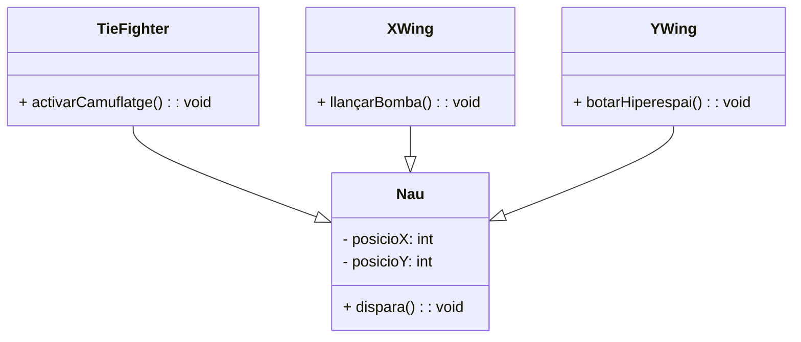
````

I es representa:


##### Implementació en Java

En Java, fem ús de la paraula reservada `extends`per indicar que una classe deriva d'una altra. Veiem com quedaria l'exemple de dalt:

```java
public class Nau {
  private int posicioX;
  private int posicioY;
  
  /* Constructor */
  public Nau () { };
  
  /* Mètodes d'accés */
  public void setPosicioX (int newVar) {
    posicioX = newVar;
  }

  public int getPosicioX () {
    return posicioX;
  }

  public void setPosicioY (int newVar) {
    posicioY = newVar;
  }

  public int getPosicioY () {
    return posicioY;
  }

  /* Altres mètodes */
  public void dispara()
  {
  }
}

```

```java
class TieFigter extends Nau {

    // Constructor
    TieFigher(){
        // Invoca al constructor del pare
        super();
    }

    // Mètodes nous
    void ActivarCamuflatge(){
        ...
    }
}
```

```java
class XWing extends Nau {

    // Constructor
    TieFigher(){
        // Invoca al constructor del pare
        super();
    }

    // Mètodes nous
    void LlançarBomba(){
        ...
    }
}
```

```java
class YWing extends Nau {

    // Constructor
    TieFigher(){
        // Invoca al constructor del pare
        super();
    }

    // Mètodes nous
    void BotarHiperespai(){
        ...
    }
}
```

Açò ens permet, per exemple, definir un objecte de tipus `XWing`:

```java
XWing nauLuke=new XWing();
```

I utilitzar tant els mètodes de `Nau` com de `XWing`:

```java
nauLuke.dispara();
nauLuke.LlançarBomba();
```

##### **Implementació en JavaScript**

En **JavaScript (ES6+),** també podem establir relacions d'herència utilitzant la paraula reservada **`extends`**. L'equivalent a l'exemple anterior en **JavaScript** seria el següent:

```javascript
// Definició de la classe base Nau
class Nau {
  #posicioX; // Atribut privat
  #posicioY;

  constructor(x = 0, y = 0) {
    this.#posicioX = x;
    this.#posicioY = y;
  }

  // Getters i Setters
  get posicioX() {
    return this.#posicioX;
  }

  set posicioX(valor) {
    this.#posicioX = valor;
  }

  get posicioY() {
    return this.#posicioY;
  }

  set posicioY(valor) {
    this.#posicioY = valor;
  }

  dispara() {
    console.log("Disparant!");
  }
}

// Definició de la classe TieFighter, que hereta de Nau
class TieFighter extends Nau {
  constructor(x, y) {
    super(x, y); // Invoca al constructor del pare
  }

  activarCamuflatge() {
    console.log("Activant camuflatge!");
  }
}

// Definició de la classe XWing, que hereta de Nau
class XWing extends Nau {
  constructor(x, y) {
    super(x, y); // Invoca al constructor del pare
  }

  llançarBomba() {
    console.log("Llançant bomba!");
  }
}

// Definició de la classe YWing, que hereta de Nau
class YWing extends Nau {
  constructor(x, y) {
    super(x, y); // Invoca al constructor del pare
  }

  botarHiperespai() {
    console.log("Botant a l'hiperespai!");
  }
}

// Exemple d'ús
const nauLuke = new XWing(10, 20);
console.log(nauLuke.posicioX); // Mostra 10
nauLuke.dispara(); // "Disparant!"
nauLuke.llançarBomba(); // "Llançant bomba!"
```

##### Classes abstractes

En principi, podrem instanciar objectes de les quatre classes. En cas que només tinguera sentit definir naus dels tipus de les subclasses, podriem definir la classe `Nau` com a *classe abstracta*, indicant que aquesta classe només serveix per definiar altres classes, però no per instanciar objectes.

Per expressar això en PlantUML fem ús de la paraula `abstract` davant la classe:

````markdown
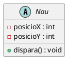
````

Que queda representat així:


Com veiem, en lloc d'una C davant la classe, apareix una A, indicant que és abstracta.

Per la seua banda, a Mermaid fem ús de la paraula clau `<<abstract>>` dins la definicó de la classe:

````markdown
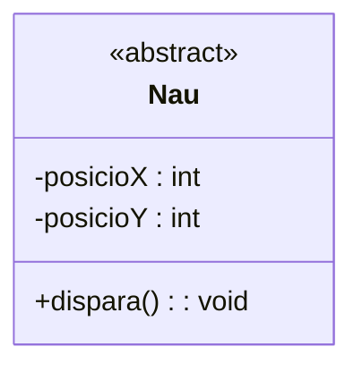
````

Que es representa mostrant `abstract` davant la classe al diagrama corresponent:

```mermaid
classDiagram
class Nau {
<<abstract>>
  -posicioX : int
  -posicioY : int
  +dispara() : void
}

```

!!!note "Notes sobre el polimorfisme"

    Un altre aspecte interessant que introdueix la programació orientada a objectes és el **polimorfisme**, que ens permet enviar missatges sintàcticament iguals a classes de diferent tipus. Per exemple, el mètode `dispara()` es pot utilitzar en qualsevol objecte de la classe `nau` o de qualsevol de les classes derivades. Açò ens permet, per exemple, en una partida, tindre una estructura de dades d'objectes genèrics, de tipus nau, que emmagatzeme naus de qualsevol tipus.

    Per exemple, podriem definir un `ArrayList` d'objectes de tipus `Nau`:

    ```java
    ArrayList<Nau> flota=new ArratList<Nau>();
    ```

    I afegir elements de qualsevol tipus derivat a dins:

    ```java
    XWing nauLuke=new XWing();
    YWing nauSnap=new YWing();
    TieFighter nauVader=new TieFighter();

    flota.add(nauLuke);
    flota.add(nauSnap);
    flota.add(nauVader);
    ```

**Sobre l'herencia múltiple**

En un diagrama de classes ens podem trobar el cas que una classe siga una especialització de dues classes ascendents. Per exemple:

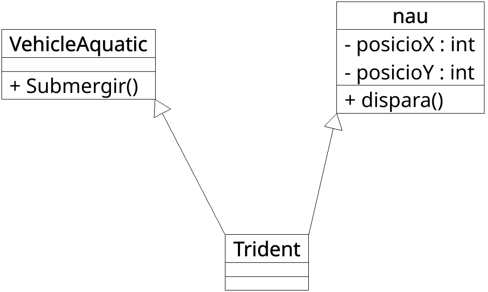{ width=300px }

En aquest exemple, la classe `Trident` és una especialització tant de `Nau` com de `VehicleAquatic`, pel que hereta les propietats i mètodes de les dos.

L'herència múltiple no està suportada en tots els llenguatges de programació. Al cas de Java i Javascript, per exemple, una classe només pot tindre una classe ascendent. Aquesta limitació del llenguatge es supleix mitjançant les **interfícies**.


#### Interfícies

Una interfície és una entitat que declara una sèrie d'atributs, mètodes i obligacions. És una espècie de *contracte* on tota instància associada a una interfície ha d'implementar els serveis que indica aquella interfície.

Com que únicament són declaracions, les interfícies no poden ser instanciades, és a dir, no podem crear objectes a partir d'una interfície.

Les interfícies s'associen a classes. Això vol dir que una classe *compleix amb el contracte* que indica la interfície, és a dir, inclou aquells mètodes i atributs que indica la interfície.

La seua representació és similar a les classes, però indicant a dalt la paraula `<<interface>>`:

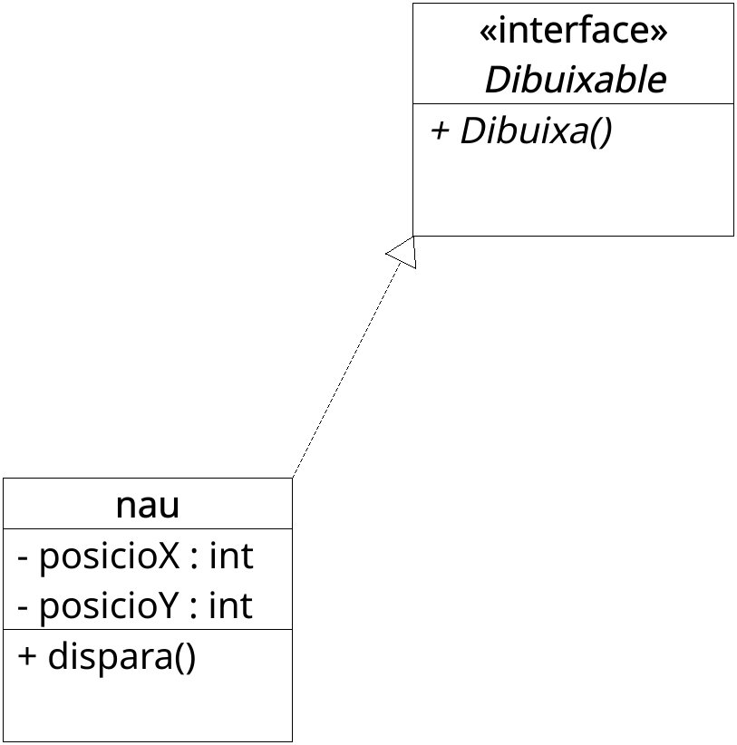{ width=250px }

En aquest exemple, una nau diem que *implementa*  la interfície `Dibuixable`, que *obliga* a les classes que la implementen a disposar d'un mètode *Dibuixa()*, per dibuixar la nau a la pantalla. En el cas de les interfícies, una **classe sí que pot implementar diverses interfícies**, suplint així la limitació de l'herència múltiple.

Com veiem, la relació entre una classe i la interfície o interfícies que implementa és amb la mateixa línia discontínua que indicàvem les relacions d'herència, amb un triangle/flexta a la *interfície*.

Per representar una intefície en PlantUML fem ús de la paraula clau *interface* en lloc de *class*:

````markdown
``` plantuml
@startuml
interface Dibuixable {
  +Dibuixa() : void
}

class Nau {
  +Dibuixa() : void
}

Nau ..|> Dibuixable
@enduml
```
````

Que es representa marcant la interfície amb una `I` i una línia discontínua:

```plantuml
@startuml
interface Dibuixable {
  +Dibuixa() : void
}

class Nau {
  +Dibuixa() : void
}

Nau ..|> Dibuixable
@enduml
```

Per la seua banda, amb Mermaid, no fem ús de la paraula *inteface* per definir la classe, però podem marcar una classe amb `<<interface>>` i expressar la relació de *implements* amb `..|>`:

````markdown
``` mermaid
classDiagram
    class Dibuixable {
      <<interface>>
        + Dibuixa()
    }

    class Nau {
        + Dibuixa()
    }

    Nau ..|> Dibuixable
```
````

```mermaid
classDiagram
    class Dibuixable {
      <<interface>>
        + Dibuixa()
    }

    class Nau {
        + Dibuixa()
    }

    Nau ..|> Dibuixable
```

##### Implementació en Java

En Java, definiriem la interfície amb la paraula clau `interface`, i faríem ús de la paraula `implements` per indicar que una classe implementa aquesta interfície:

```java
public interface Dibuixable {
  public void Dibuixa();
}

public class Nau implements Dibuixable{

  ...
  public void Dibuixa(){
      ...
  }

}
```

Per la seua banda, Javscript no suporta interícies com a tal. En lloc d'això, podem optar per diverses opcions més avançades, com per exemple, fer ús de classes abstractes (que limita la implementació de múltiples interfícies), el duck typing, implementar mixins de manera manual, o fer ús directament de typescript.

# 3. Dibuixant diagrames de classes

Els diagrames de classe estan associats al disseny orientat a objectes. A mode de guía, els passos que generalment seguim a l'hora de realitzar aquest disseny seran els següents:

* **Identificar les classes,** que solen correspondre's a substantius dins el domini del problema (client, factura, jugador, etc.)
* **Identificar les relacions**  entre les diferents classes, els punts en comú i les abstraccions entre elles, de manera que ajude a agupar-los en dibuixar el diagrama de classes.
* **Crear l'estructura** fent ús dels connectors apropiats entre les classes, donant especial atenció a la multiplicitat o les herències. Els atributs i mètodes es perfilaran més tard, una vegada estiga l'estructura del diagrama resolta.

Algunes **bones pràctiques** que podem tindre en compte a l'hora de generar diagrames de classes són:

* Quan els diagrames creixen poden tornar-se incoherents i poc clars. És preferible crear diagrames menuts que després pogam vincular entre ells que un gran diagrama que es preste a confussió.
* Per començar, podem fer ús de la notació de classe més simple per tindre una visió general d'alt nivell del sistema (pràcticament un entitat-relació), i perfilar-lo després amb els atributs i mètodes.
* Cal assegurar la major claredat en els diagrames, organitzant bé les classes, i evitant coses com, per exemple que es creuen o superposen línies que representen relacions, ja que es presta a confussió.
* De vegades, també és útil fer ús de colors per agrupar mòduls comuns, i ajudar així al lector/client a diferenciar-los.