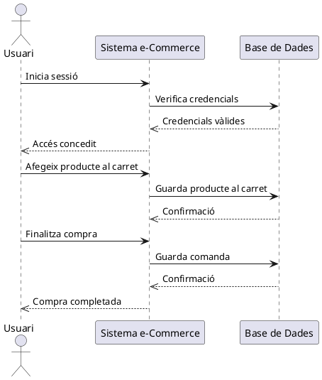
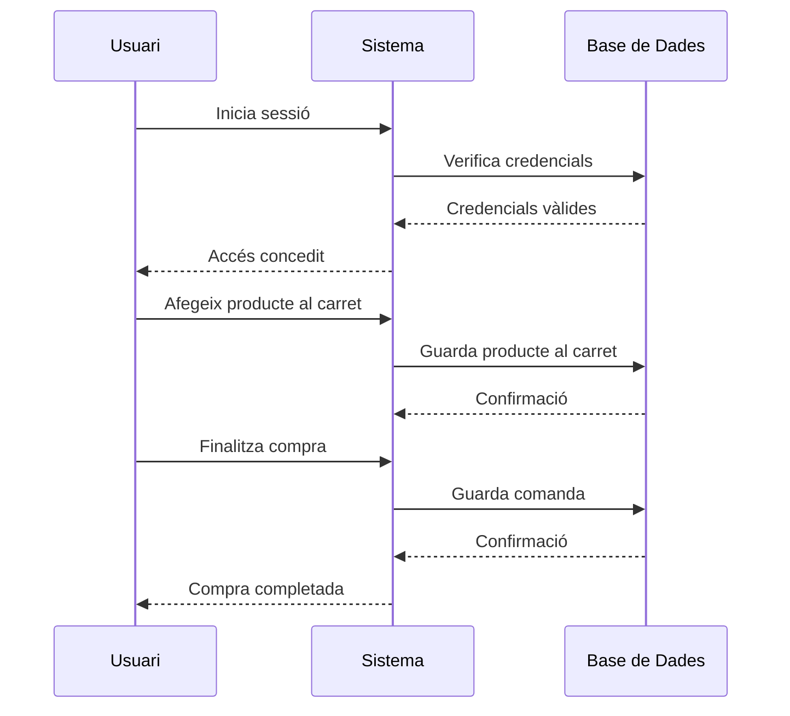
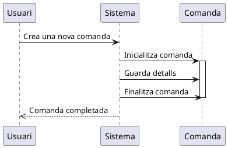
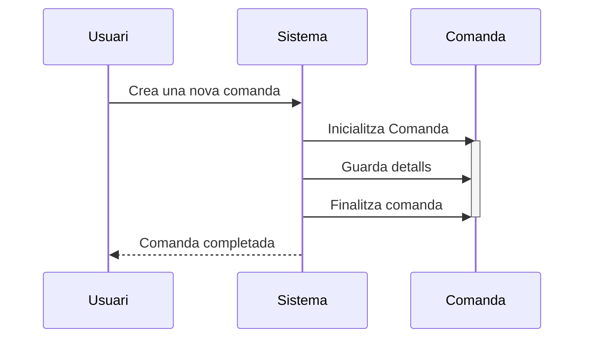

# Diagrames de seqüència

Els **diagrames de seqüència** són un tipus de **diagrama de comportament** en UML que mostren la seqüència d’interaccions entre els diferents **actors** i **subsistemes participants** en els **casos d'ús**, representats ara com **classes del sistema**.

Aquests diagrames descriuen **com interactuen els objectes entre si** mitjançant **missatges** enviats en un ordre temporal, detallant **el flux d'execució d'un procés concret**.

## Elements principals d'un diagrama de seqüència

Els diagrames de seqüència es componen de diversos elements clau:

### Actors i Objectes

Els diagrames de seqüència representen **entitats** o **components** del sistema que participen en la comunicació. 

Aquestes entitats s'expressen amb un rectangle amb el seu nom a dalt i poden ser:

* **Actors**, que són les entitats externes al sistema(usuaris, sistemes extern,...).
* **Objectes**, que són les classes o instàncies que participen en el procés.

### **Línies de vida**

Les línies de vida, o de temps, representen l'existència d'un objecte al llarg del temps.

Aquestes es dibuixen com **línies verticals** que parteixen de cada actor o objecte, i representen la seua evolució al llarg del temps.

### **Missatges**

Els missatges indiquen comunicació entre objectes i actors, i representen mètodes invocats en altres ojbectes.

Aquests mètodes poden ser de diferents tipus:

* **Síncrons** (`-->` en PlantUML): L'emissor espera la resposta abans de continuar.
* **Asincrònics** (`->` en PlantUML): L'emissor envia el missatge però no espera la resposta.

### **Activacions**

Una activació representa el temps en què un objecte està actiu processant una acció.

Es representen com **blocs rectangulars** a la línia de vida.

### **Retorns**

Els retorns indiquen la resposta d'un missatge enviat. Es dibuixen amb una **fletxa discontínua** (`-->>` en PlantUML).

### **Creació i Destrucció d’Objectes**

Un objecte pot ser creat durant el procés (`create` en PlantUML) i pot ser destruït (`destroy`), representat amb una "X" a la línia de vida.


## **Exemple bàsic de diagrama de seqüència**

Veiem un exemple que representa el procés de realització d’un encàrrec en una botiga en línia.

### **Representació en PlantUML**


````markdown

````

Que es representa de la següent manera:


### **Representació en Mermaid**

````markdown

````

Que es representa així:


### Creació i destrucció en PlantUML i Mermaid

Veiem com incorporar la creació i destrucció d'objecte en PlantUml i Mermaid amb el següent exemple:

````markdown

````

Que es representa de la següent forma:


En Mermaid, l'exemple anterior es representaria amb:

````

````

I tindria la següent representació:


!!!note "Referències"

     * [Diagamas de secuencia](https://diagramasuml.com/secuencia/)
     * [Diagrames de seqüencia en PlantUML](https://plantuml.com/sequence-diagram)
     * [Diagrames de seqüència en Mermaid](https://mermaid.js.org/syntax/sequenceDiagram.html)


