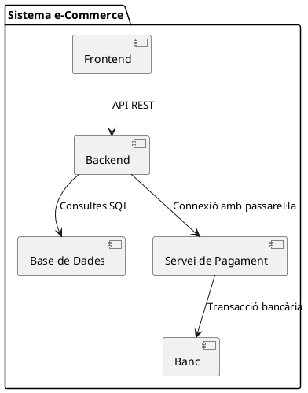
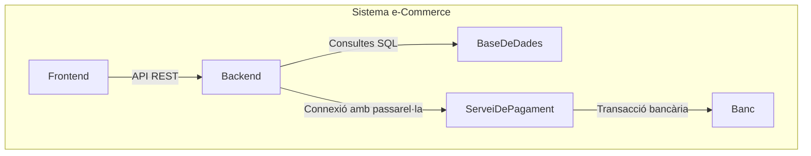

# Diagrama de components

Els **diagrames de components** són un tipus de diagrama estructural en UML que mostra com les diferents parts d'un sistema estan organitzades i com interactuen entre si. Es fan servir per representar **l’arquitectura física i l’estructura de les dependències** en un sistema complex.

A diferència dels **diagrames de classes**, que descriuen el model conceptual i l’estructura lògica d’un sistema, els **diagrames de components** mostren **com les diferents parts s'agrupen en components reutilitzables** i com aquests components es comuniquen entre ells.

## Elements d'un diagrama de components

Els diagrames de components es componen principalment dels següents elements:

### Components

- Representen **mòduls o unitats del sistema** que encapsulen una funcionalitat específica.
- Es dibuixen com **rectangles amb dues caixes menudes** als costats.
- Cada component pot representar una **biblioteca**, un **mòdul**, un **servei**, un **microservei**, etc.

### Interfícies i Connectors

- Els components es comuniquen a través d’**interfícies**.
- Les **interfícies proporcionades** (el component ofereix funcionalitat) es representen amb un **semicercle** (`◦`).
- Les **interfícies requerides** (el component necessita funcionalitat d’un altre component) es representen amb un **connector tipus socket** (`⊂`).

### Dependències

- Indiquen **com es relacionen els components** mitjançant línies de connexió.
- Es poden representar amb una fletxa de dependència (`-->`) per indicar que un component depèn d'un altre.


## Exemple bàsic de diagrama de components

Veiem un exemple d'un sistema de **compres en línia**, on diferents components interactuen entre si.

### Representació en PlantUML

Un sistema bastant comú de compres en línia es podria representar amb el següent diagrama de components:



Aquest diagrama està estructurat dins d'un **paquet** (`package "Sistema e-Commerce"`), que agrupa els components del sistema. Això ajuda a organitzar millor el diagrama quan tenim molts components. 

Aquests components són:

| **Component**            | **Funció** |
|--------------------------|------------|
| **Frontend**             | Interfície d'usuari, aplicació web o mòbil que interactua amb el sistema. |
| **Backend**              | Gestor de la lògica de negoci, gestiona la base de dades i interacciona amb serveis externs. |
| **Base de Dades**        | Emmagatzema informació del sistema (usuaris, comandes, productes, etc.). |
| **Servei de Pagament**   | Passarel·la de pagament externa que permet processar transaccions. |
| **Banc**                 | Entitat financera que valida i autoritza els pagaments. |

I les connexions entre aquests components són:

| **Connexió** | **Descripció** |
|--------------|--------------|
| `Frontend --> Backend : API REST` | El **Frontend** (app web/mòbil) interactua amb el **Backend** a través d'una API REST. |
| `Backend --> Base de Dades : Consultes SQL` | El **Backend** consulta i actualitza la **Base de Dades** mitjançant **SQL**. |
| `Backend --> Servei de Pagament : Connexió amb passarel·la` | El **Backend** s’encarrega d'enviar informació de pagament a una **passarel·la de pagament externa** (ex: PayPal, Stripe). |
| `Servei de Pagament --> Banc : Transacció bancària` | El **Servei de Pagament** envia la sol·licitud de transacció a l'**entitat bancària**, que l’aprova o la rebutja. |

El funcionament d'aquests compoents és el següent:

1. **Un usuari accedeix al Frontend** (una web o aplicació mòbil).
2. **El Frontend sol·licita informació al Backend** a través de **peticions API REST**.
3. **El Backend consulta la Base de Dades** per obtenir informació sobre productes, ordres o usuaris.
4. **Quan un usuari realitza una compra**, el **Backend envia una sol·licitud de pagament** a un **Servei de Pagament extern**.
5. **El Servei de Pagament contacta amb el Banc** per processar la transacció.
6. **El Banc confirma o rebutja la transacció** i retorna la resposta al **Servei de Pagament**.
7. **El Servei de Pagament informa el Backend** de l'estat de la transacció.
8. **El Backend actualitza la Base de Dades** i envia la confirmació al **Frontend**.

#### Representació amb PlantUML

El diagrama anterior, es representaria amb:

````markdown
``` plantuml
package "Sistema e-Commerce" {
    [Frontend] --> [Backend] : API REST
    [Backend] --> [Base de Dades] : Consultes SQL
    [Backend] --> [Servei de Pagament] : Connexió amb passarel·la
    [Servei de Pagament] --> [Banc] : Transacció bancària
}
@enduml
```
````


#### Representació en Mermaid

El diagrama anterior podría representar-se amb Mermaid com a un diagrama de flux:

````markdown

````

Que es representarà així:


## Què aporten els diagrames de components?

- Els **diagrames de components** són de gran importància per comprendre l'arquitectura d'un sistema i com les parts interactuen entre si.
- **PlantUML i Mermaid** permeten representar-los de manera senzilla i eficient.
- Són útils per **documentar aplicacions modernes**, especialment aquelles basades en **microserveis** i **arquitectures distribuïdes**.
