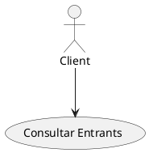
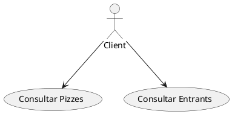
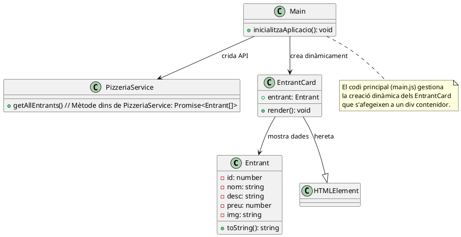
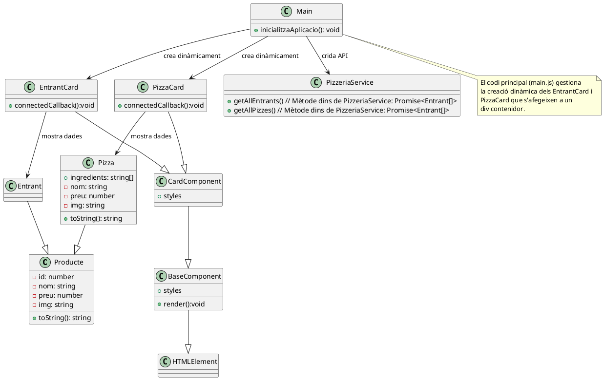
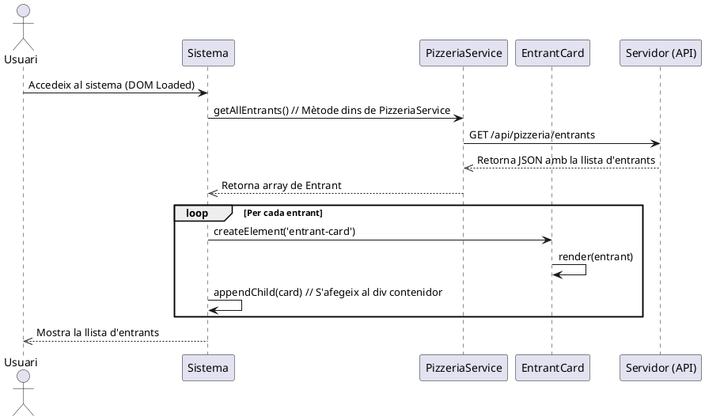
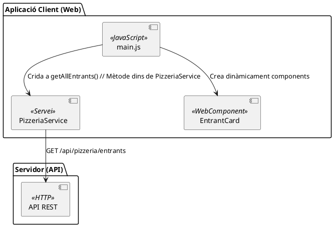

# El Just Eat Pizza. Sprint 2

En aquest segon Sprint, anem a incorporar un nou cas d'ús senzill per a la consulta d'entrants, i molt semblant a l'anterior.

Afegirem:

* El diagrama de casos d’ús per consultar entrants i la seua corresponent especificació
* El diagrama de classes adaptant el model.
* El diagrama de seqüència per reflectir la consulta d’entrants.
* el diagrama de components per mostrar la interacció dels nous mòduls.

## Diagrama de casos d'ús

Aquest diagrama *Consultar Entrants* mostrarà **l'actor principal (el client)** i les interaccions amb el sistema per realitzar l'acció.

Per tant, la integració amb el cas anterior quedaria:

L'especificació de requeriments funcionals per a aquest segon cas d'ús tindrà el següent aspecte:

## Cas d'ús: RF02

- **Nom:** Consultar Entrants  
- **Actors:** Client  
- **Descripció:** El client consulta el menú d'entrants disponibles a través de la interfície web.  
- **Precondicions:** El client ha d'accedir a la web.  
- **Postcondicions:** Es mostra la llista d'entrants o un missatge d'error si hi ha algun problema.  

### Flux principal  

1. El client accedeix al sistema mitjançant el navegador.  
2. El sistema mostra la llista d'entrants disponibles a la secció corresponent.

### Fluxos alternatius (excepcions)  

- **Error de connexió:** El sistema mostra un missatge d'error si no es pot contactar amb el servidor.  
- **Llista buida:** Si no hi ha entrants disponibles, s’informa l'usuari que el menú està buit.  

## Diagrama de classes

Per tal d'implementar aquest nou cas d'ús, identificarem les següents **classes noves**, fent una distinció entre les classes pròpies del domini i les classes que es corresponene al a implementació del servei.

* **1. Classes del model (domini)**
    - **`Entrant`**: Representa un entrant amb les seues característiques.  
* **2. Classes de servei** 
    - **`PizzeriaService`**: Gestiona la comunicació amb el servidor per obtenir la llista d'entrants.
* **3. Classes de la interfície (WebComponents)**
    - **`EntrantCard`**: WebComponent que representa visualment un entrant.  

### Integració de la biblioteca de components i refactorització

En aquest sprint, s'ha incorporat la **biblioteca de components**, la qual estructura els WebComponents de manera jeràrquica. Els components ara s'organitzen així:

- **`EntrantCard`** ara **descendeix de `CardComponent`**, aprofitant una implementació comuna per a targetes de productes.
- **`CardComponent`** hereta de **`BaseComponent`**, que proporciona una estructura bàsica per a components.
- **`BaseComponent`** descendeix de **`HTMLElement`**, garantint que tota la lògica comuna es centralitze en una sola classe base.

A més, s'ha refactoritzat el model de dades:

- **S'ha creat la classe `Producte`**, que encapsula atributs comuns entre `Pizza` i `Entrant`.
- **`Pizza` i `Entrant` ara hereten de `Producte`**, facilitant la reutilització de codi i afegint consistència a la implementació.

Veiem com queden reflexats aquests canvis al diagrama de classes

## Diagrama de seqüència

Aquest diagrama mostrarà la seqüència d'interaccions necessària perquè el client puga consultar els entrants disponibles.

## Diagrama de components

Veiem com queda el **diagrama de components** amb l'arquitectura del sistema i la interacció entre els diferents mòduls.

!!!note "Implementació"
    [Consulteu la implementació d'aquest sprint](https://joamuran.net/curs24_25/lmi/u3_webcomponents/sprint2/)
