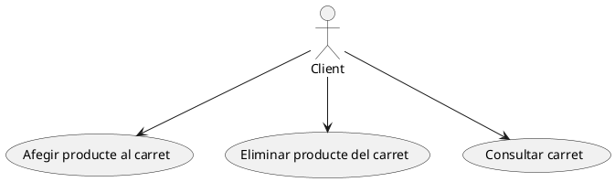
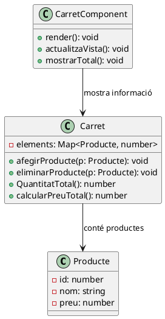
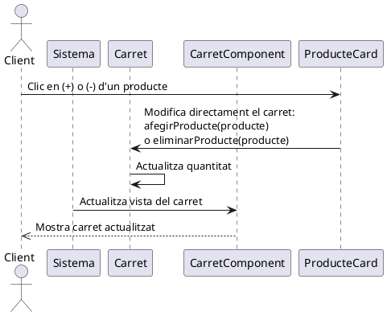
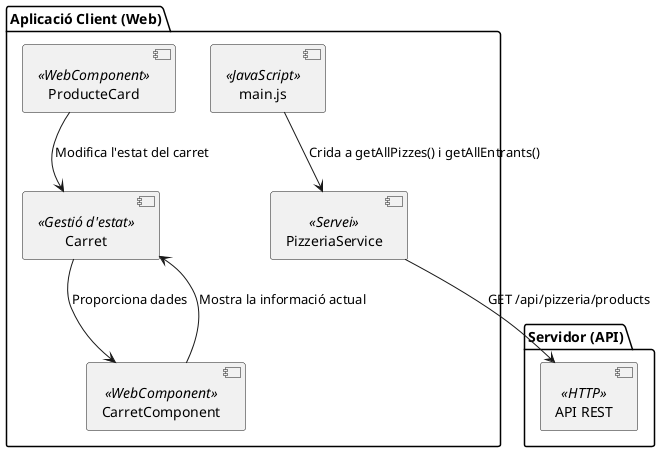

# Sprint 3. Afegir un carret de la compra

En aquest sprint anem a afegir una nova funcionalitat i incorporar un carret de la compra, que ens permeta afegir i eliminar productes per fer un encàrrec. Es podran consultar els productes del carret i modificar-ne la seua quantitat des del mateix carret

A més, a la part superior, junt amb el títol de l'aplicació, apareixerà informació del carret, on es mostrarà la quantitat de productes que hi ha i el preu total de l'encàrrec.

## Diagrama de casos d'ús

Les dues accions principals que aportarà aquest sprint seran **afegir un producte** i **eliminar un producte**.

L'especificació dels requeriments funcionals d'aquests casos d'ús és la següent:

## Cas d'ús: RF03 - Afegir producte al carret

- **Nom:** Afegir producte al carret
- **Actors:** Client
- **Descripció:** El client fa clic al botó (+) d’un producte (tant des de la pestanya de productes com des del carret) i aquest s’afegeix al carret de la compra.
- **Precondicions:** El client ha d'accedir a la web i veure el menú de productes.
- **Postcondicions:** El producte s'afegeix al carret i s'actualitza la quantitat i el preu total a la barra del títol.

### Flux principal

1. El client visualitza la llista de productes o el carret.
2. El client fa clic al botó (+) d'un producte.
3. El sistema afegeix el producte al carret.
4. La quantitat i el preu total s’actualitzen a la barra del títol.

### Fluxos alternatius (excepcions)

- **Error en l’operació:** Si hi ha un problema afegint productes, es mostra un missatge d'error.

## Cas d'ús: RF04 - Eliminar producte del carret

- **Nom:** Eliminar producte del carret
- **Actors:** Client
- **Descripció:** El client pot eliminar un producte del carret des de dues ubicacions:
  1. Directament des del llistat de productes (pizzes o entrants) fent clic al botó `-`.
  2. Des de la pestanya del carret, on pot reduir unitats o eliminar un producte completament.
- **Precondicions:** Ha d’haver almenys una unitat del producte al carret.
- **Postcondicions:** La quantitat i el preu total s'actualitzen a la barra del títol. Si el producte arriba a 0 unitats, desapareix del carret.

### Flux principal

1. El client visualitza la llista de productes o el carret.
2. El client fa clic al botó (-) d'un producte.
3. El sistema redueix la quantitat d’aquell producte en el carret.
4. La quantitat i el preu total s’actualitzen a la barra del títol.
5. Si la quantitat arriba a 0, el producte s’elimina del carret.

### Fluxos alternatius (excepcions)

- **Error en l’operació:** Si hi ha un problema en la reducció, es mostra un missatge d'error.

## Cas d'ús: RF05 - Consultar el carret

* **Nom**: Consultar el carret
* **Actors**: Client
* **Descripció**: El client pot accedir a la pestanya del carret per veure els productes afegits, la seua quantitat i el preu total.
* **Precondicions**: Ha d'haver almenys un producte al carret per a mostrar informació.
* **Postcondicions**: Es mostra la llista de productes amb la seua quantitat i el preu total.

### Flux principal

1. El client accedeix a la pestanya del carret.
2. El sistema mostra la llista de productes afegits.
3. Es visualitzen la quantitat de cada producte i el preu total de la comanda.

### Fluxos alternatius (excepcions)

* **El carret està buit**: Es mostra un missatge indicant que el client encara no ha afegit productes.

## Diagrama de classes

Veiem la part del diagrama de classes que es correspondrà només a aquesta cas d'ús. En ell veiem l'estructura del carret, com es relaciona amb els productes, i com es representa amb un component.

## Diagrama de seqüència

Aquest diagrama mostra la interacció entre l’usuari, el carret i la interfície quan es realitza una acció d’afegir o eliminar un producte al carret.

## Diagrama de components

Aquest diagrama mostra la relació entre els diferents components del sistema, incloent el fet que `ProducteCard` també interactua amb el carret.

!!!note "Implementació"
    [Consulteu la implementació d'aquest sprint](https://joamuran.net/curs24_25/lmi/u3_webcomponents/sprint3/)
