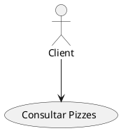
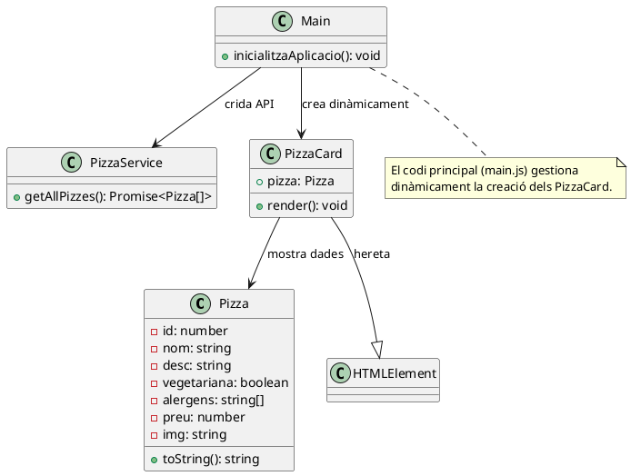
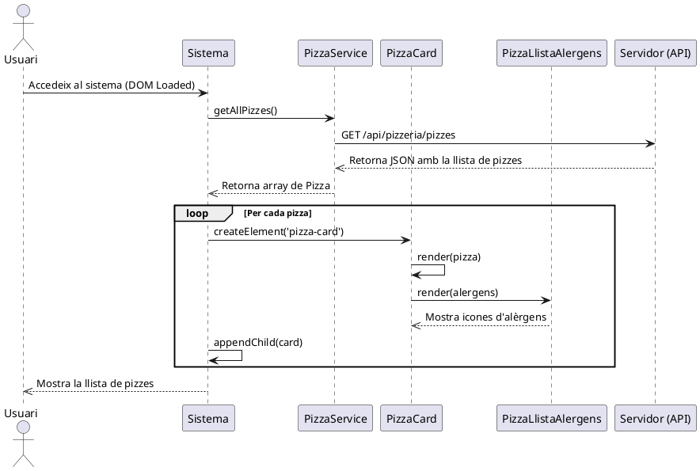
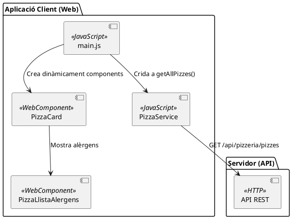

# Resolució de l'sprint 1

## Diagrama de casos d'ús

El diagrama de casos d'ús per al cas "Consultar Pizzes" mostrarà **l'actor principal (el client)** i les interaccions amb el sistema per realitzar aquesta acció.

Es tractaria d'un diagrama bastant simple:

L'especificació dels requeriments funcionals d'aquest cas d'ús tindrà el següent aspecte:

## Cas d'ús: RF01

- **Nom:** Consultar Pizzes  
- **Actors:** Client
- **Descripció:** El client consulta el menú de pizzes disponibles a través de la interfície web.  
- **Precondicions:** El client ha d'accedir a la web.  
- **Postcondicions:** Es mostra la llista de pizzes o un missatge d'error si hi ha algun problema.  

### Flux principal  

1. El client accedeix al sistema mitjançant el navegador.  
2. El sistema mostra la llista de pizzes disponibles.  

### Fluxos alternatius (excepcions)  

- **Error de connexió:** El sistema mostra un missatge d'error si no es pot contactar amb el servidor.  
- **Llista buida:** Si no hi ha pizzes disponibles, s’informa l'usuari que el menú està buit.  

## Diagrama de classes

El **diagrama de classes** ens permet identificar les classes necessàries per implementar el cas d'ús "Consultar Pizzes" i les relacions entre elles.

Després d'analitzar el cas d'ús, identifiquem les següents classes:

### **1. Classes del model (domini)**

- **`Pizza`**: Representa una pizza amb les seues característiques.  
- **`PizzaService`**: Gestiona la comunicació amb el servidor per obtenir la llista de pizzes.

### **2. Classes de la interfície (WebComponents)**
- **`PizzaCard`**: WebComponent que representa visualment una pizza.  
- **`PizzaList`**: WebComponent que s'encarrega de mostrar la llista de pizzes rebuda.
- **`LlistaAlergens`**: Per representar amb una etiqueta el que serà una llista d'imatges amb els diferents alergens.

!!!note "Notes"
     * Les classes d'interfície es poden incloure en el diagrama general o bé en un diagrama específic d'interfície d'usuari. En aquest cas, les inclourem per entendre la interacció amb el model.  
     * Per al diagrama de classes ens centrarem en la part del client, abstraient tota la part del servidor.

## Diagrama de classes en PlantUML

### **Què hem representat aci?**

1. **Model de dades:** `Pizza` representa el model amb els seus atributs.  
2. **Gestió de la lògica de negoci:**  `PizzaService` encapsula la lògica per a la consulta de pizzes.
3. **Interfície d'usuari:** `PizzaCard` gestiona la presentació.  Com veiem, aquesta utilitza la classe Pizza, i és una subclasse d'`HTMLElement`.

Tingueu en compte que hem definit una entitat *Main* que realment vam implementar com un script. Ara bé, això podria implementar-se com una classe, i seguir un model completament orientat a objectes.

## Diagrama de seqüència

Aquest diagrama mostrarà la seqüència d'interaccions necessària perquè el client puga consultar les pizzes disponibles. 

El flux de la seqüència serà el següent:

1. El client carrega la pàgina i el codi de main.js inicia el procés.
2. PizzaService fa una crida a l'API REST del Servidor.
3. El Servidor consulta la base de dades i retorna la llista de pizzes.
4. El PizzaService processa les dades i les retorna a main.js.
5. main.js crea dinàmicament un PizzaCard per a cada pizza i l'insereix al DOM.
6. Cada PizzaCard mostra la informació de la pizza i, si cal, genera una llista d'alèrgens amb PizzaLlistaAlergens (això serà en properes iteracions).

**Observeu que s'ha afegit el renderitzat de la llista d'alèrgens, que haureu d'implementar vosaltres**

## Diagrama de components

El **diagrama de components** ens ajuda a visualitzar l'arquitectura del sistema i la interacció entre els diferents mòduls que el conformen. En aquest cas, reflectirem:  

- L'aplicació client basada en **WebComponents**.  
- El servei de comunicació amb l'API.  
- La interacció amb el servidor.  

Els components principals de què constarà doncs l'aplicació seran:

1. **Mòdul `main.js`:**  
   - Punt d'entrada de l'aplicació.  
   - Gestiona la creació dinàmica dels components.  

2. **Mòdul `PizzaService`:**  
   - Gestiona la comunicació amb el servidor via `fetch`.  

3. **Components WebComponents:**  
   - **`PizzaCard`:** Mostra les dades de cada pizza.  
   - **`PizzaLlistaAlergens`:** Mostra gràficament els alèrgens.  

4. **API del servidor:**  
   - Serveix les dades a través d'una crida `GET`.  

El diagrama resultant serà:

Com veiem, la part client conté bàsicament com a components les classes que hem generat anteriorment, i s'interactúa ambel sistema del servidor a través de l'API.

!!!note "Implementació"
    [Consulteu la implementació d'aquest sprint](https://joamuran.net/curs24_25/lmi/u3_webcomponents/sprint1/)