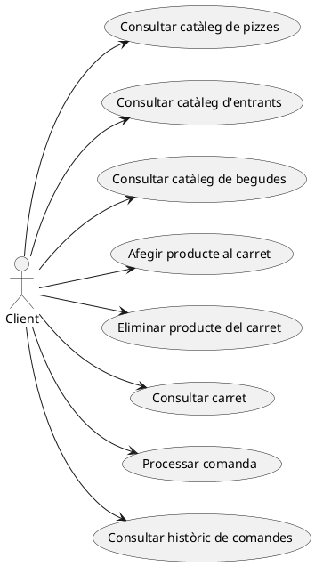
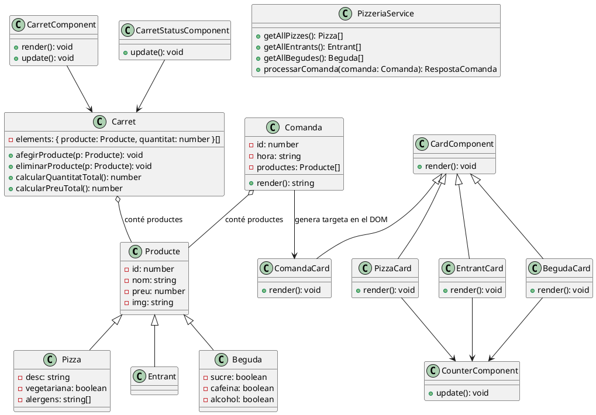
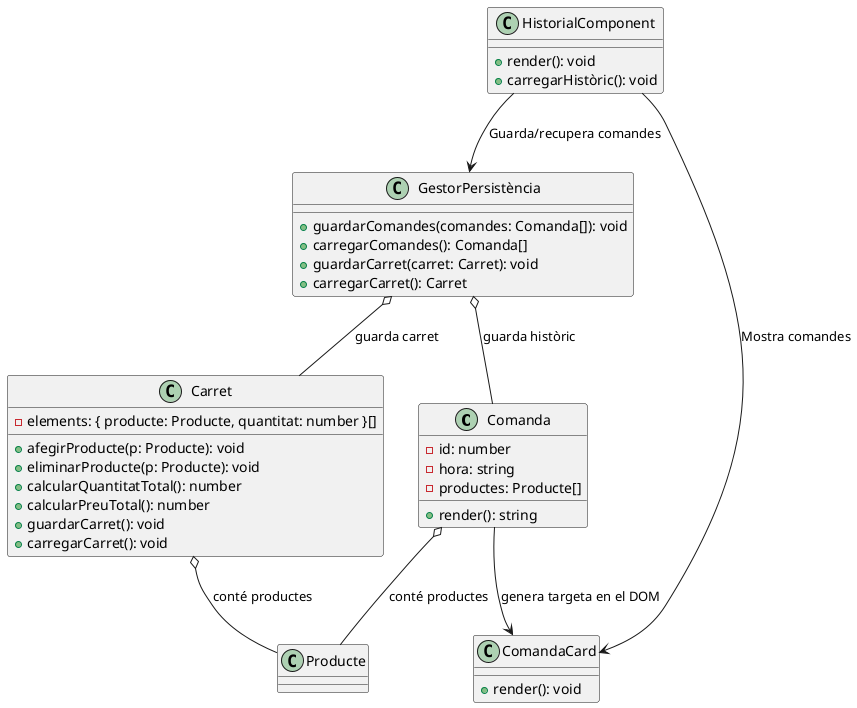
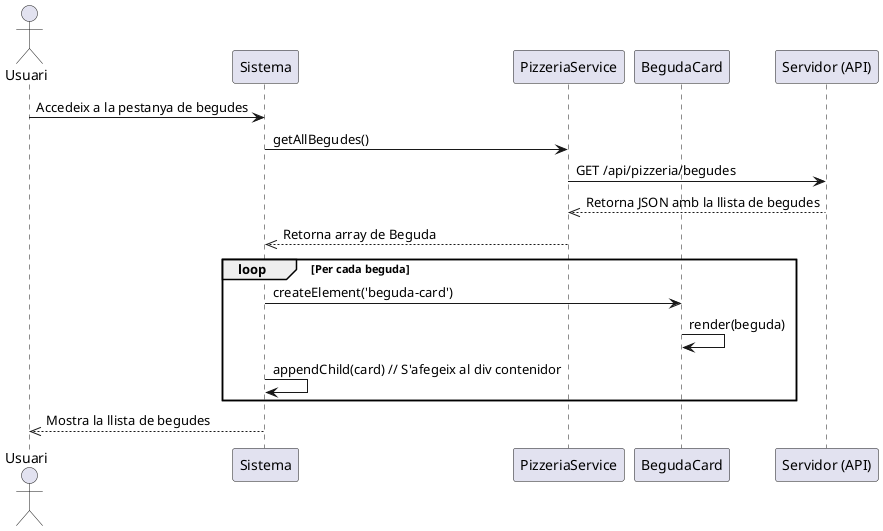
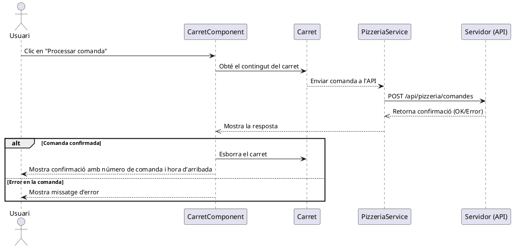
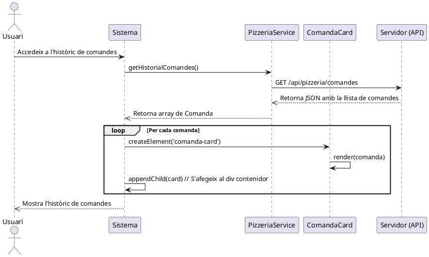
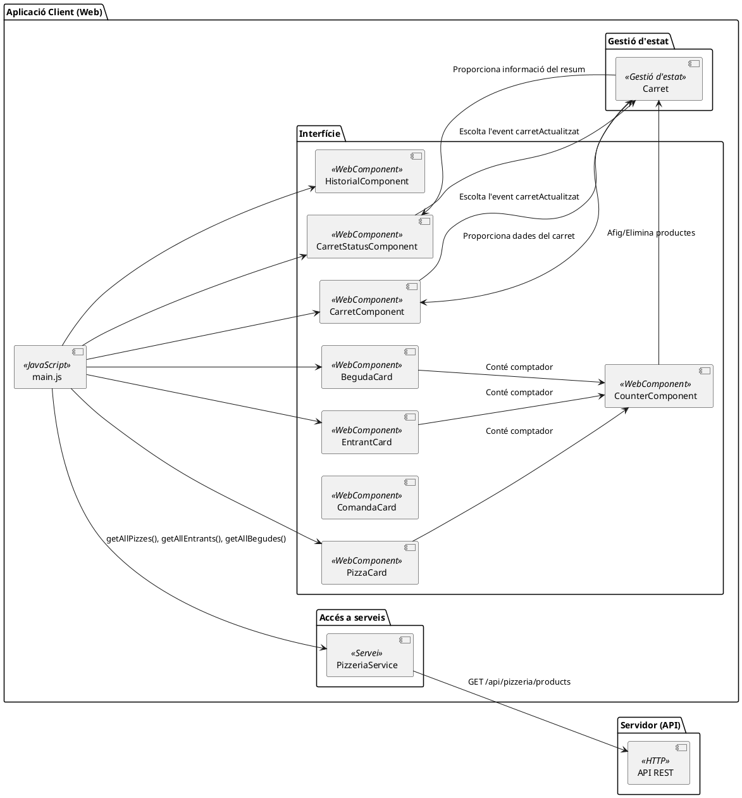
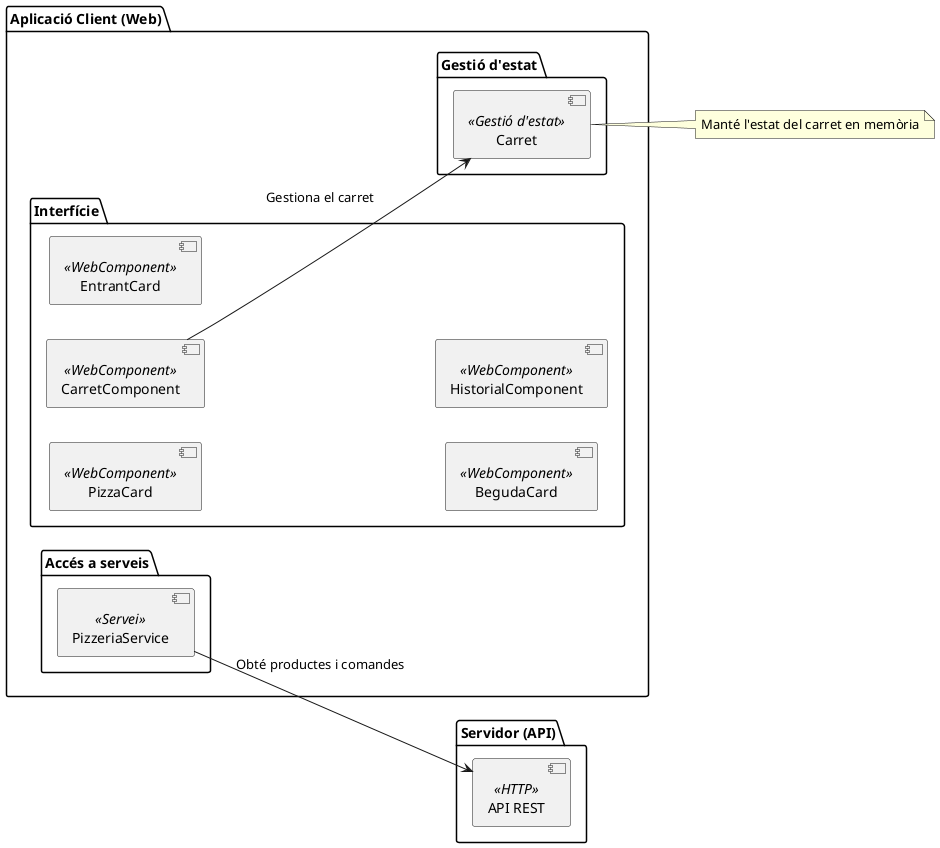

# Sprint 4. Resolució.

## Diagrama de casos d'ús

En aquest diagrama, incorporem els casos d'ús per demanar begudes i processar la comanda.

## Especificació dels requisits funcionals

Els nous requeriments funcionals quedaran especificats de la següent manera:

### **Cas d'ús: RF06 - Consultar catàleg de begudes**

- **Nom:** Consultar catàleg de begudes  
- **Actors:** Client  
- **Descripció:** El client pot accedir a la pestanya de begudes per veure la llista de begudes disponibles.  
- **Precondicions:** El client ha d'accedir a la web i veure el menú de productes.  
- **Postcondicions:** Es mostra la llista de begudes disponibles, incloent informació com nom, preu i característiques (sucre, cafeïna, alcohol).  

#### **Flux principal**
1. El client accedeix a la pestanya de begudes.  
2. El sistema obté la llista de begudes de l'API i genera les targetes corresponents.  
3. El client visualitza les begudes disponibles.  

#### **Fluxos alternatius (excepcions)**
- **Error en la càrrega de dades:** Si hi ha un problema en la comunicació amb l'API, es mostra un missatge d'error.  

!!!caution "Compte"
    Ací és fàcil caure en l'error de voler *enriquir* els requisits amb la possibilitat d'afegir i eliminar begudes al carret.

    Cal tindre en compte que aquestes no són funcionalitats noves en aquest sprint, ja que estan cobertes pels casos d'ús *Afegir productes al carret* i *Eliminar Productes al carret*.

    Aquests dos casos d'ús són genèrics, i ja inclouen qualsevol producte (pizzes, entrants, i ara begudes).

### **Cas d'ús: RF07 - Processar comanda**

- **Nom:** Processar comanda  
- **Actors:** Client  
- **Descripció:** Quan el client ha completat la selecció de productes al carret, pot enviar la comanda a la pizzeria. El servidor confirma la recepció i retorna l'hora prevista d'arribada i el número de comanda.
- **Precondicions:** El carret conté productes.
- **Postcondicions:** Si la comanda s'envia correctament, es mostra un missatge de confirmació amb l'hora d'arribada i el número de comanda, i s'elimina el contingut del carret. Si hi ha un error, es mostra un missatge d'error.

#### **Flux principal**

1. El client accedeix a la pestanya del carret.  
2. El client fa clic en el botó "Processar comanda".  
3. El sistema envia la comanda a l'API REST del servidor.
4. L'API REST retorna una resposta amb la confirmació de la comanda.  
5. El sistema mostra la confirmació de la comanda amb l'hora estimada d'arribada.  
6. La comanda s'afegeix a l'històric de comandes i el carret es buida.  

#### **Fluxos alternatius (excepcions)**

- **Error en l'enviament:** Si hi ha un problema en la comunicació amb el servidor, es mostra un missatge d'error.  
- **Comanda rebutjada:** Si el servidor retorna un error, es mostra el missatge indicat per l'API.  

A més, tenim com a *extra* el següent requisit per consultar l'històric de comandes. Recordem que fins ara, aquest no serà persistent.

### **Cas d'ús: RF08 - Consultar històric de comandes**

- **Nom:** Consultar històric de comandes  
- **Actors:** Client  
- **Descripció:** El client pot accedir a la pestanya d’històric de comandes per veure una llista de les comandes realitzades prèviament.  
- **Precondicions:** Ha d'haver almenys una comanda processada.  
- **Postcondicions:** Es mostra la llista de comandes anteriors amb el número de comanda, l’hora d’arribada i els productes de la comanda.  

### **Flux principal**
1. El client accedeix a la pestanya d’històric de comandes.  
2. Es mostren les comandes realitzades en la sessió actual en format de targeta amb la informació corresponent.  

**Nota**: L'històric de comandes només es manté durant l'execució de l'aplicació. No es guarda en cap base de dades ni emmagatzemament local, de manera que no persisteix quan es recarrega la pàgina.

### **Fluxos alternatius (excepcions)**
- **Històric buit:** Si encara no s’ha realitzat cap comanda en la sessió actual, no es mostra res en l'històric.  
- **Error en la càrrega de dades:** Si hi ha un problema en la consulta, es mostra un missatge d’error.  

## Diagrama de classes

El diagrama de classes, en la seua versió més senzilla es mostra de la següent manera:

!!!note "Algunes reflexions sobre persistència i gestió de l'estat"
    En aquest punt, és fàcil confondre dos conceptes que hem esmentat però no hem treballat produndament: la gestió de l'estat i la persistència.

    * **Gestió de l’estat**: mecanisme que manté informació temporal durant l'execució de l'aplicació, com per exemple, el contingut del carret.
    * **Persistència**: Guarda informació entre sessions perquè no es perda en recarregar l'aplicació (com per exemple un històric de comandes que volguerem emmagatzemar)

    Com veiem, estracta de conceptes diferents, tot i que estan relacionats:

    * L’estat es guarda en memòria mentre l’aplicació està oberta,
    * La persistència ens permetria restaurar l'estat després de tancar i tornar a obrir l'aplicació.
    * En moltes ocasions, és interessant oferir persistència a l'estat. En l'exemple que estem veient, podriem voler mantenir el carret persistent si es refresca la pàgina, però tenim molts altres exemples, com mantenir les pantalles que teniem superades en un videojoc o les converses iniciades en una aplicació de missatgeria.
  
    En aquest exemple, no es demana incorporar persistència en cap lloc. Si volguerem guardar l'històric de comandes, podriem fer-ho en local, en el propi navegador fent ús del `localStorage`, o directament en el servidor, on ja caldria incorporar gestió d'usuaris per associar les comandes, etc, i l'arquitectura potser se'ns complicaria una miqueta.

!!!note "Un component per a l'històric?"
    Un altre punt que podríem discutir és si incorporar o no un nou component a la interfície per a l'històric. En Sprints anteriors, per a l'apartat de les pizzes, els entrants i ara les begudes, no hem utilitzat cap tipus de component específic per a aquests, però sí que ho hem fet per al carret. Per què?

    El motiu és que el carret té un comportament específica, i per exemple, ha d'estar pendent de quan s'afig o s'elimina algun producte per actualitzar-se, però en la resta de casos no. 

    Per al cas de l'històric de comandes, si no va a tindre cap comportament especial, podem ignorar aquest component.

    No obstant això, i per tal de millorar-ne la modularitat i possibles amplicacions, podria plantejar-se incorporar un component específic per a l'històric (i fins i tot, també components per a les begudes, pizzess o entrants!)

Tenint en compte les dues anotacions anteriors, en cas que volguerem afegir aquesta persistència, i a més, afegir un WebComponent per mostrar l'historial, en lloc de fer-ho en un div directament, implementaríem les següents classes.

Amb això tenim:

* Una nova classe `GestorPersistència` per gestionar l'emmagatzemament (p. ex. en localStorage)
* Ara `Carret`  tindrà els mètodes `guardarCarret()` i `carregarCarret()` per poder recuperar l'estat després de reiniciar l'aplicació.
* Hem afegir un `GestorPersistència` que gestiona tant la persistència del carret com la de les comandes.
* Hem afegit el component `HistorialComponent` qeue encapsula la visualització de comandes guardades.

## Diagrames de seqüència

Una vegada definit el **diagrama de classes**, podem abordar els **diagrames de seqüència** seguint la mateixa estructura que hem utilitzat en els sprints anteriors.

Generarem doncs els diagames de seqüència per a :

* Consultar el catàleg de begudes, que indicarà com es carrega i es mostra la llista de begudes,
* Processar una comanda, on veurem com s'envia la comanda al servidor i mostrar la resposta.

I tot i que no es demanava, vaurem també el diagrama per consultar l'històric de comades.

### Diagrama de seqüència: Consultar el catàleg de begudes

### Diagrama de seqüència: Processar una comanda

### Diagrama de seqüència: Consultar l’històric de comandes

## Diagrama de components

Els diagrames de components tenen com a objectiu mostrar l'**arquitectura d'alt nivell d'una aplicació**, representant com es relacionen els diferents components entre si i com interactuen amb els serveis externs. No obstant això, quan el sistema creix i incorpora molts elements, el diagrama pot convertir-se en massa complex i difícil de llegir.

En el diagrama anterior s'han reflexat totes les connexions entre els components del sistema, incloent la creació de cadascun per part del fitxer principal (main.js) i totes les interaccions directes entre ells.

Aquest diagrama presenta alguns problemes per poder interpretar-lo a primera vista:

* Té massa connexions, fent que el flux d’informació siga difícil de seguir.
* El fitxer *main.js* està representat per crear cada component, quan en realitat això no aporta informació rellevant en quant a l'arquitectura.
* Les connexions entre components que ja s’entenen implícitament (com `CounterComponent` dins de `PizzaCard`) no caldria dibuixar-les explícitament.

Així doncs, és preferible treballar amb una simplificació d'aquest diagrama, que millore la legibilitat i ens ajude a entendre millor l'arquitectura del sistema. 

Veiem com quedaria:

En aquest diagrama, ara es reflexa principalment els diferents components que formen l'arquitectura de l'aplicació (interfície, serveis, gestió de l'estat). Com veiem, hem eliminat el main.js, hem reduit les connexions directes, i només hem mostrat les dependències més rellevants. Si alguna cosa requereix d'alguna aclaració, podem fer ús de notes per explicar els diferents conceptes o explicar relacions sense afegir més línies.
