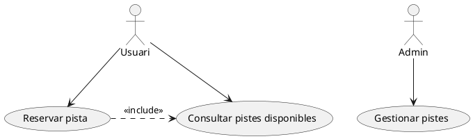
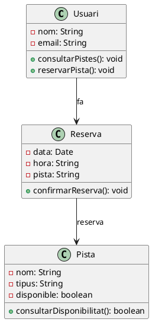
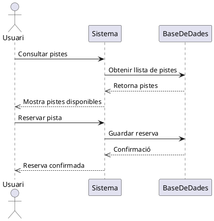
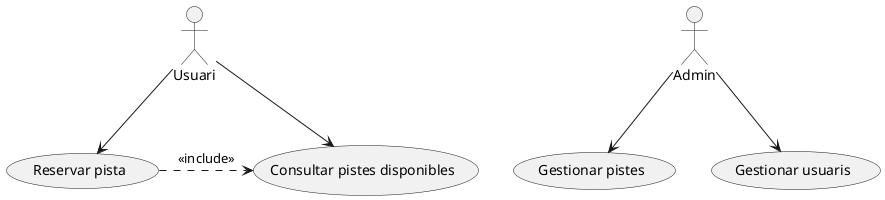
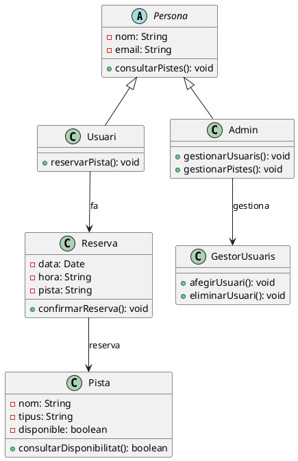
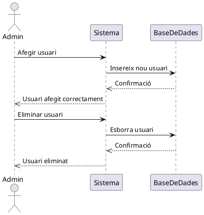
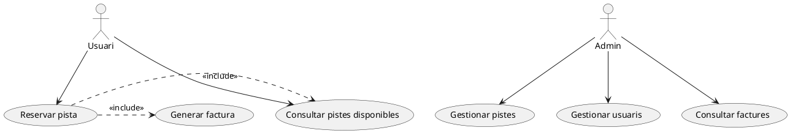
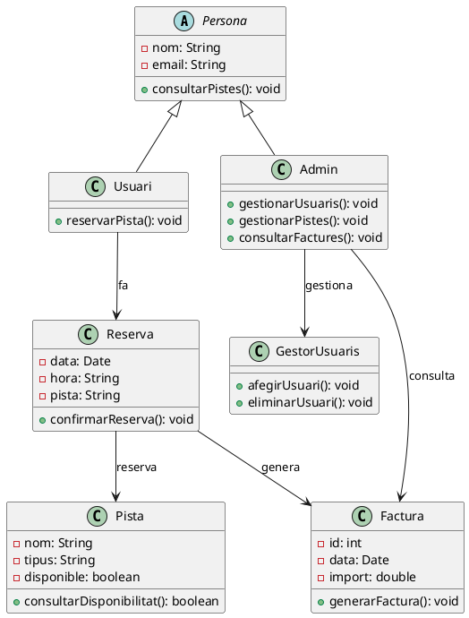
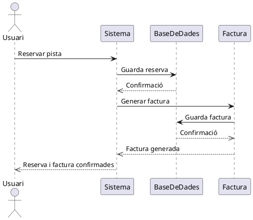

# Casos pràctics

## Sistema de reserves esportives

Anem a realitzar un **sistema de reserves en línia per a un centre esportiu**, que ofereix serveis com la reserva de pistes, la gestió d’usuaris i la generació de factures. Per a això, realitzarem tres, els quals faran evolucionar els diferents diagrames UML utilitzats.

### **Objectiu general del projecte:**  
7.Exercicis
Desenvolupar una aplicació que permeta als usuaris reservar pistes esportives, gestionar les seues reserves i generar factures.

## **Sprint 1: Sistema bàsic de reserves**

**Objectiu del sprint:**  

Permetre als usuaris reservar una pista esportiva.

### **Requeriments identificats:**

- Els usuaris han de poder veure les pistes disponibles.
- Han de poder reservar una pista concreta.
- El sistema ha de guardar la reserva.

!!!question "Diagrames de casos d'ús"
    

### 🖼️ **Diagrama de casos d'ús (PlantUML)**  

---

### 🛠️ **Diagrama de classes inicial (PlantUML)**

---

### 🔄 **Diagrama de seqüència (PlantUML)**  

---

## 📈 **Sprint 2: Afegim gestió d'usuaris**

**Objectiu del sprint:**  
Permetre que els administradors puguen gestionar els usuaris i diferenciar entre tipus d'usuari.

### 🔹 **Requeriments identificats:**
- Els administradors han de poder afegir i eliminar usuaris.  
- Cal distingir entre usuaris **normals** i **administradors**.  

---

### 🖼️ **Diagrama de casos d'ús actualitzat (PlantUML)**  

---

### 🛠️ **Diagrama de classes actualitzat (PlantUML)**

---

### 🔄 **Diagrama de seqüència actualitzat (PlantUML)**  

---

## 🔍 **Sprint 3: Afegim facturació**

**Objectiu del sprint:**  
Implementar la generació i gestió de factures per a les reserves realitzades.

### 🔹 **Requeriments identificats:**
- El sistema ha de generar una factura després de fer una reserva.  
- Els administradors han de poder consultar les factures.  

---

### 🖼️ **Diagrama de casos d'ús final (PlantUML)**  

---

### 🛠️ **Diagrama de classes final (PlantUML)**

---

### 🔄 **Diagrama de seqüència final (PlantUML)**  

---

## ✅ **Reflexió del procés**

Aquest cas pràctic mostra com:

1. **El disseny UML es pot desenvolupar iterativament.**  
2. Cada **sprint amplia i actualitza els diagrames** per incorporar les noves funcionalitats.  
3. **PlantUML permet representar fàcilment els canvis** amb diagrames de casos d'ús, classes i seqüències.  

Amb aquesta metodologia, **UML s'integra de manera natural amb SCRUM** i altres metodologies àgils, adaptant-se a les necessitats del projecte a cada iteració.